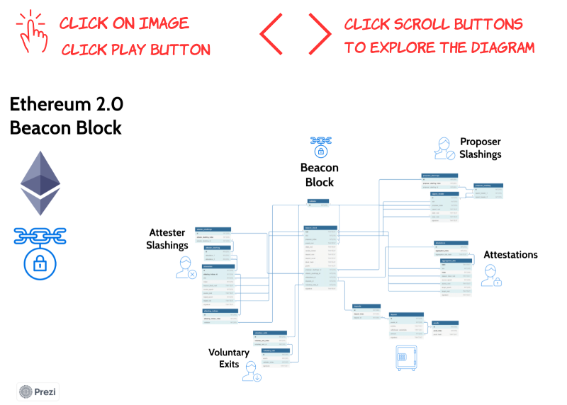
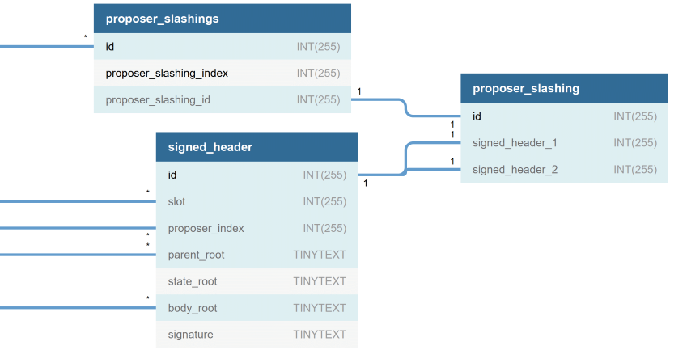
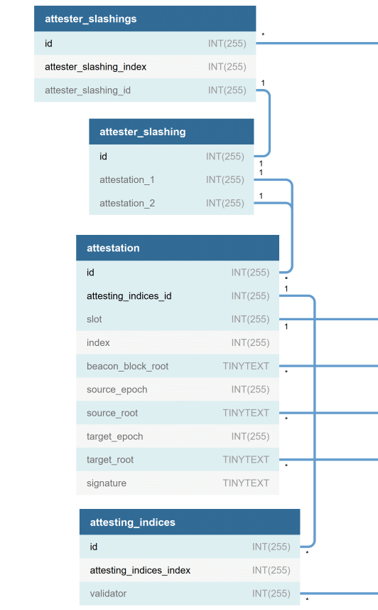
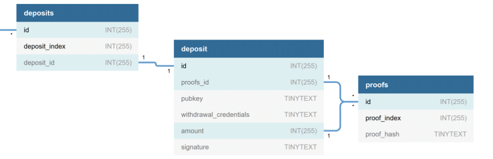

# The Ethereum 2.0 Beacon Block: A Data Schema and Visual Documentation

**Gurdal Ertek, Joseph Kholodenko**

**Summary:** *Ethereum 2.0* is the new version of the Ethereum blockchain, where consensus (agreement on which data and blocks will be appended to the blockchain) is to be achieved through theproof-of-stake (PoS) protocol. 
Coordination of consensus and many other processes in Ethereum 2.0 will be carried out by a critical chain within the Ethereum 2.0 architecture, the *beacon chain*.
This article presents interactive visualizations and sample data to facilitate the understanding of data in the *beacon block*, the block which is the building block of the beacon chain. 
Such an understanding is critical for any technical participant in the Ethereum 2.0 ecosystem, including developers, auditors, validators, and data engineers/scientists.
As a methodological and pedagogical contribution, our article demonstrates how interactive 3D visualizations, data schema diagrams, and zoomable presentations can be applied to describe and communicate blockchain concepts and meta-data, not only for Ethereum, but for any blockchain.

> *"When I came up with Ethereum, my first thought was, 'Okay, this thing is too good to be true.' As it turned out, the core Ethereum idea was good - fundamentally, completely sound."* ***Vitalik Buterin***


Photo by <a href="https://unsplash.com/@scarlett_jedi?utm_source=unsplash&amp;utm_medium=referral&amp;utm_content=creditCopyText">Carol Kennedy</a> on <a href="https://unsplash.com/@Scarlett_jedi?utm_source=unsplash&amp;utm_medium=referral&amp;utm_content=creditCopyText">Unsplash</a>

## Ethereum and Ethereum 2.0
The Ethereum blockchain, initially envisioned by [Vitalik Buterin](https://medium.com/@VitalikButerin), is the first [*triple-entry ledger*](https://hackernoon.com/why-everyone-missed-the-most-important-invention-in-the-last-500-years-c90b0151c169) system in human history, that can serve as an enabling platform for *smart contracts*, transactional contracts that can automatically run on the blockchain.
Ethereum 1.0, the Ethereum blockchain that achieves consensus through proof-of-work (PoW), is already the second most powerful computing platform on the face of earth.
In PoW, consensus regarding which data blocks are valid and are to be appended to the blockchain is achieved through intensive distributed computing, referred to as *mining*.
The Ethereum Community and the Ethereum Foundation envison things to become much bigger. Exponentially bigger.

Yet, there is a roadblock. 
Ethereum 1.0 is also limited by the very PoW consensus protocol that makes it so much secure, decentralized, reliable and -almost unbreakably- robust: 
As of October 2020, the time of this article being written, transactions fees on the Ethereum blockchain network have become substantially higher than before, even at one point reaching twice the previous all-time-high (ATH) costs.
The bottleneck is the proof-of-work (PoW) protocol and its shortcomings.

An existentially inevitable milestone in Ethereum's journey to become ["The Infinite Machine"](https://www.amazon.com/Infinite-Machine-Crypto-Hackers-Building-Internet/dp/B07XJ7WKXL/ref=sr_1_1?dchild=1&keywords=infinite+machine&qid=1602161947&s=books&sr=1-1) 
is Ethereum's version 2.0, i.e, Ethereum 2.0. 
Upon the completion of the three Phases of Ethereum 2.0, namely Phase 0, Phase 1, and Phase 2, Ethereum blockchain will be fully functional without any dependence to any [*Layer 2 solution*](https://ethereum.org/en/developers/docs/layer-2-scaling/), such as [xDai Chain](https://www.xdaichain.com/). A comprehensive list of resources on Ethereum 2.0 can be found [online](https://hackmd.io/@benjaminion/eth2_info).

The focus of this article is the *beacon block*, a block on the beacon chain of Ethereum 2.0, and is to be introduced as the main deliverable of Ethereum 2.0's Phase 0. 
Beacon chain is at the center of the Ethereum 2.0 network. Understanding the beacon chain is a critical step for any organization, team, or individual who plans to develop applications on Ethereum 2.0 or interact with it at code level.
Specifically, the article holds the magnifier on the beacon chain block, through data collected from the *Medalla testnet*.

As of October 2020, Ethereum 2.0 is being tested on the Medalla testnet, which is to run for about three months, as well as other testnets that run over few days. There exist numerous comprehensive techincal documentations of Ethereum 2.0 and the beacon chain. Our focus is specifically on the *data* within the beacon block. This article provides a user-friendly visual introduction to Ethereum 2.0's Beacon Block and the data therewithin, through interactive 3D visualization, data schema diagram, and zoomable presentation. While the descriptions and visualizations illustrate the concepts and data within Ethereum 2.0 Phase 0, the visualization methods, tools, and presentation styles are designed to serve as an example of how such information can be communicated for any current or future blockchain to orient blockchain developers, auditors, validators, and data engineers/scientists.

## Beacon Chain and Beacon Block
Before understanding of the data within the beacon block, we find it essential to share how it fits within Ethereum 2.0's architectural design. Based on a 2D illustration of Ethereum 2.0 architecture by [Hsiao-Wei Wang](https://docs.google.com/presentation/d/1G5UZdEL71XAkU5B2v-TC3lmGaRIu2P6QSeF8m3wg6MU/edit#slide=id.p4), the interactive 3D visualization in Figure 1 illustrates the beacon chain within the overall architecture and in relation to the other chains in Ethereum 2.0. An excellent list of definitions for the various Ethereum 2.0 terms are provided by [Alethio here](https://medium.com/alethio/ethereum-2-a-validators-journey-through-the-beacon-chain-843f70aaab2e), which can be referred to hand-in-hand with the 3D visualization in Figure 1, to have a better understanding of Ethereum 2.0's architecture. 

<a href="https://grabcad.com/library/ethereum-2-0-sharding-3d-visualization-1" target="_blank"></a>

[Figure 1. Interactive 3D visualization of chains and sharding in Ethereum 2.0.](https://grabcad.com/library/ethereum-2-0-sharding-3d-visualization-1) [(Source: Ben Edgington)](https://media.consensys.net/state-of-ethereum-protocol-2-the-beacon-chain-c6b6a9a69129). 

The beacon chain (Figure 1) can be thought of "the chain that rules them all", it is the chain within Ethereum 2.0 which is central to the system and its processes. 
As analogy, similar to how the spine of a human connects and holds together the body, the beacon chain will connect and hold together the many chains in Ethereum 2.0. 
Yet, unlike the spine of a human, which remains static, the beacon chain will grow over epochs of time, together with the other chains and components of the system. 

Let us review some basic terminology for Ethereum 2.0, in relation to the PoS consensus process:

- The atomic time unit in Ethereum 2.0 is a *slot*, which is issued every 12 seconds. 
- Every slot can accomodate at most one data block. Every 32 slots (about 6,5 minutes) constitute an *epoch*.  
- Consensus on the Ethereum 2.0 blockchain will be achieved through the participation of *validators*, which are in essence client software running in parallel on a distributed network of computers. 
- The [journey of a validator](https://medium.com/alethio/ethereum-2-a-validators-journey-through-the-beacon-chain-843f70aaab2e) begins by the installation of the client software, deposit of at least 32 ETH (Ethereum) coins to the node's wallet, and joining a waiting queue to be admitted. 
- Once a validator is admitted, at each slot, there are two main roles that it may be assigned to by the network, namely role of *(block) proposer* and the role of *(block) attester*. A proposer (a validator with the proposer hat on) proposes blocks to be added to the blockchain. 
- An attester (a validator with the attestor hat on) votes on whether the block is valid and should be appended to the network, as the proposer suggests. 
- Attesters vote within one of multiple *committees*, where committees are formed freshly at every epoch. 
- Each validator is invited every epoch exactly once to serve in one of the many committees. 
- The Ethereum 2.0 network incentivizes compliant behavior on the part of the validators through various [rewards and penalties](https://codefi.consensys.net/blog/rewards-and-penalties-on-ethereum-20-phase-0), while keeping them in the network. 
- If a validator, in the role of proposer *or* attester, is proven to commit fraud, it is *slashed*, meaning that it is involuntarily and forcefully removed by the system from the network. 
- Slashed validator are *not* allowed to participate in the network again.

While many details exits, we refer interested readers to two fascinating articles by [Ben Edgington](https://media.consensys.net/state-of-ethereum-protocol-2-the-beacon-chain-c6b6a9a69129) and [Jim McDonald](https://www.attestant.io/posts/understanding-the-validator-lifecycle/) which describe the working mechanics of the beacon chain and Ethereum 2.0 overall. 

Beacon chain is the focus and the ultimate deliverable of Phase 0 of Ethereum 2.0. In the latter Phases 1 and 2, other components of the system will be added. 
Yet, for other systems to operate successfully and integrate to the whole, the Beacon chain must be functioning flawlessly. 

## Beacon Block Data Schema

The [technical specification document under Ethereum's GitHub repository](https://github.com/ethereum/eth2.0-specs/blob/v0.12.1/specs/phase0/beacon-chain.md) is a primary document in the community that lists the specifications of Ethereum 2.0. Furthermore, the [annotated technical specification for the Beacon Chain by (Ben Edgington)](https://benjaminion.xyz/eth2-annotated-spec/phase0/beacon-chain/#beaconblockbody) provides the descriptions of the data fields in the beacon chain and the processes executed on the chain. Both these documentations sources, as well as those listed under the [latter]((https://benjaminion.xyz/eth2-annotated-spec/phase0/beacon-chain/#beaconblockbody)) are quite comprehensive in scope. Since the mentioned documents are mainly in text format, we aim in this our article to visually communicate of the data specifications with actual sample data.

The data schema that we present in the remainder of the article, beginning with Figure 2, represents the data that can be retrieved by [Eth2 Beacon Node API](https://ethereum.github.io/eth2.0-APIs/). 
While this API allows the retrieval of an extensive array of data, our focus in this article is the [`/eth/v1/beacon/`](https://ethereum.github.io/eth2.0-APIs/#/Beacon) endpoint.
The [Eth2 Beacon Node API](https://ethereum.github.io/eth2.0-APIs/) documentation also provides sample data, yet the provided sample data can be extended to more fields. In our discussion, we provide extensive actual data from the [Medalla testnet](https://github.com/goerli/medalla), the final long-lasting testnet of Ethereum 2.0 Phase 0.

As presented in Figure 2, a notable contribution of our article is the structured parsing of the data in the `/beacon/block/` end node API into tables of a relational database.
The database schema also provides the [data types for MySQL](https://www.javatpoint.com/sql-data-types#:~:text=SQL%20Data%20Types%201%20String%20Data%20types%202,Data%20types%203%20Date%20and%20time%20Data%20types), 
the key attributes of each table, and the foreign keys that relate the tables to each other.
For the sake of simplicity, all bigint data types of Ethereum 2.0 have been represented as INT(255) and all hash strings -while many of them require much less memory- have been represented as TINYTEXT. 

The Database Markup Language (DBML) is used to describe the schema and each of its tables. The [dbdiagram.io](http://dbdiagram.io) service by [holistics.io](http://holistics.io) conveniently converts the schema code written in DBML into an interactive data schema, as in Figure 2 in this article.

The data schema diagram in Figure 2 is interactive and is ideal for exploring the relations between the tables through foreign keys. 

<a href="https://dbdiagram.io/d/5f6653cb7da1ea736e2e8295" target="_blank"></a>

[Figure 2. Interactive data schema diagram (dbdiagram) for Ethereum 2.0 Beacon Block.](https://dbdiagram.io/d/5f6653cb7da1ea736e2e8295)


The next visualization is a zoomable presentation (Figure 3), which shows different groups of related tables as a part of the whole. 
This presentation can help understand better the different groups of tables and the data fields in each table.

<a href="https://prezi.com/p/z5sf3nyicten/?present=1" target="_blank"></a>

[Figure 3. Zoomable data schema diagram for Ethereum 2.0 Beacon Block with sample data.](https://prezi.com/p/z5sf3nyicten/?present=1)


## Data Tables and Fields within Beacon Block

In this section of the article, we provide the details of the data schema presented earlier, focusing on each section of the diagram one by one. We list the data fields for each table, identify the primary and foreign keys, and provide sample data for each field (where applicable). 

The [json files](https://github.com/blockblockdata/medalla-data-challenge/tree/master/a001/code) corresponding to the full data extracted from the mentioned beacon blocks are available under the [GitHub repository](https://github.com/blockblockdata/medalla-data-challenge/tree/master/a001/code). 

In the DBML specification of the schema, 
- TINYTEXT and INT(255) are the two data types for string/hash and big integer, assuming that the data will be imported to MySQL. 
- `pk` refers to primary key(s), whereas 
- `-`, `<`, and `>` respectively refer to one-to-one, one-to-many, and many-to-one relations. 
- `note`s provide example data from different actual beacon blocks from the Medalla testnet. 

Regarding the sample data:
- Beacon block in slot 139 is used to illustrate the beacon block body and proposer slashings. 
- Beacon block in slot 688 is used to illustrate attester slashings and attestations. 
- Beacon block in slot 1005 is used to illustrate deposits and beacon block in slot 29758 are used to illustrate voluntary exits. 
- These blocks are also where the respective events of proposer slashing, attester slashing, deposit, and voluntary exits are written/reported for the first time in the Medalla testnet.

The six sections of the data schema (Figures 2 and 3) are described next, one by one. We recommend readers to open the [technical specification document under Ethereum's GitHub repository](https://github.com/ethereum/eth2.0-specs/blob/v0.12.1/specs/phase0/beacon-chain.md) and the [annotated technical specification for the Beacon Chain by (Ben Edgington)](https://benjaminion.xyz/eth2-annotated-spec/phase0/beacon-chain/#beaconblockbody) to complement the descriptions provided here.

### Beacon Block 


- The `beacon_block` table starts with the hash string that represents the root of the Merkle tree in that block. 
- The block resides on a given `slot` and the id for the proposer of the block is stored in the `proposer_index` field. 
- The table contains foreign keys to other tables through the `proposer_slashings_id`, `attester_slashings_id`, `attestations_id`, `deposits_id`, and `voluntary_exits` foreign key fields.


The following [DBML](https://www.dbml.org/docs/) code snippet lists the fields, specifies the primary and foreign keys, and provides sample data (from block on slot 139 of the Medalla testnet) for the `beacon_block` table:

``` javascript 
//***********************************************************
// sample block data from Medalla Testnet is block @ slot 139
Table beacon_block as bb {
root                   TINYTEXT  [pk, unique,                        note: 'ex: 0x2d424c3838d2b49d9c8da4e8297471f375b872ea4b250a75127e89175b44ba70']
slot                   INT(255)  [                                   note: 'ex: 139']
proposer_index         INT(255)  [ref: - validator.id,               note: 'ex: 2185']
parent_root            TINYTEXT  [ref: - beacon_block.root,          note: 'ex: 0x19c7252f6150f964fa62cc94e7ff9df79b74c552bf3d134b1f7a317c01662c1d']
state_root             TINYTEXT                                     [note: 'ex: 0xb9739996c890b47251eecab6643b7400ff992bf76ed75b26f0b04146ea4cd640']
randao_reveal          TINYTEXT                                     [note: 'ex: 0x820574e5514420659826e18b183d7d0478389bce4a08464427168c97e67884c5d38839675313688d4ada52259becb1a40b8ee7ccaf983c9ae56d69c0000a7114006c6bb640a515075b7610b8bdf21506d4146787550ddd89a5ed8956ce470bb6']
deposit_root           TINYTEXT                                     [note: 'ex: 0x53d90f778f975dcca3f30e072b5c1a85cfd7a1b977b78620d94f143d06432f9b']
deposit_count          TINYTEXT                                     [note: 'ex: 22637']
block_hash             TINYTEXT                                     [note: 'ex: 0xe0c057333355956e8fb8d88382f5676bbe083fbf8b978f0db719b4d02ae70777']
graffiti               TINYTEXT                                     [note: 'ex: 0x53746566616e2333393137000000000000000000000000000000000000000000']
proposer_slashings_id  INT(255) [ref: < proposer_slashings.id,       note: 'ex: '] 
attester_slashings_id  INT(255) [ref: < attester_slashings.id,       note: 'ex: '] 
attestations_id        INT(255) [ref: < attestations.id,             note: 'ex: ']
deposits_id            INT(255) [ref: < deposits.id,                 note: 'ex: ']
voluntary_exits_id     INT(255) [ref: < voluntary_exits.id,          note: 'ex: ']
signature              TINYTEXT                                     [note: 'ex: 0xaa4bba19b1c185002f446cc79e24bcf917808569394669b4fea9b855f2f49e6f76c2408384d8ded3d151ed5ab238951a137a777958525bdf58c6fa75d6418ae4f5e67177747040919f81a86a1065355b2d1abb1553bc94630a6c06e4a67e5fe4']
}
``` 

The [json file](https://github.com/blockblockdata/medalla-data-challenge/tree/master/a001/code) for block on slot 139 can be downloaded from the article's [GitHub repository](https://github.com/blockblockdata/medalla-data-challenge/tree/master/a001/code). 

While the [Eth2 Beacon Node API](https://ethereum.github.io/eth2.0-APIs/#/Beacon) enables the extraction of detailed data about validators, the `/eth/v1/beacon/` endnodes do not provide any information regarding the validators, and hence we represent the validators as a table with only the validator's `id`.

``` javascript 
//***********************************************************
// for now, validator is presented only as a value, the proposer to block @ slot 139 is taken as example
Table validator {
id                     INT(255) [pk,                                 note: 'ex: 2185']
}
```


### Proposer Slashings


- The `proposer_slashings` table relates -with a foreign key- to a set slashing data records, where data for individual slashings is stored in the `proposer_slashing` table.
- Each `proposer_slashing` refers to two `signed_header`s, which provide the `slot` for which the slashing is reported, `proposer_index` of the slashed proposer, and other fields.



The following [DBML](https://www.dbml.org/docs/) code snippet lists the fields, specifies the primary and foreign keys, and provides sample data (from block on slot 139 of the Medalla testnet) for the tables related to proposer slashings:

``` javascript 
//***********************************************************
// sample block data from Medalla Testnet is block @ slot 139
Table proposer_slashings {
id                     INT(255) [pk, increment,                      note: 'ex: ']
proposer_slashing_index  INT(255) [pk,                               note: 'ex: 1']
proposer_slashing_id     INT(255) [ref: - proposer_slashing.id,      note: 'ex: ']
}

Table proposer_slashing {
id                     INT(255) [pk, increment,                      note: 'ex: ']
signed_header_1        INT(255) [ref: - signed_header.id,            note: 'ex: ']
signed_header_2        INT(255) [ref: - signed_header.id,            note: 'ex: ']
}

Table signed_header {
id                     INT(255) [pk, increment,                      note: 'ex: ']
slot                   INT(255) [ref: > beacon_block.slot,           note: 'ex: 138']
proposer_index         INT(255) [ref: > validator.id,                note: 'ex: 2329']
parent_root            TINYTEXT [ref: > beacon_block.root,           note: 'ex: 0x9ad72edd1303a10d292bf8ad84360d30b309a85fd0ee9f4143821f5a3ec01da1']
state_root             TINYTEXT                                     [note: 'ex: 0x1b067135c44e9b472608a58499f7e13561dbc0f4fd9ae3ebd9f6ddae298cebbe']
body_root              TINYTEXT [ref: > beacon_block.root,           note: 'ex: 0xa9905d68bfe2f4bde96020c4a5b66b62ef575b8c5096bbf5d042ee4795f13f80']
signature              TINYTEXT                                     [note: 'ex: 0xa5e55750045079ee500ce6176c3ea83ae1ceb415357e6019a43641cf15a961bc7cc799923a1b0d019be0a6c6138b89e7025a57cedabbd262ceefe44931052b083e99d92624a91ace8f16acd6647f7234391df2e3e3f77a68816072793e8a718d']
}
```

As mentioned earlier, block on slot 139 is the first block in the Medalla testnet where a proposer slashing is written/reported. 

The [json file](https://github.com/blockblockdata/medalla-data-challenge/tree/master/a001/code) for block on slot 139 can be downloaded from the article's [GitHub repository](https://github.com/blockblockdata/medalla-data-challenge/tree/master/a001/code). 

A very important point is that the reported proposer slashing is *not* for the slot that the source beacon block resides on, but for the block that resides on the slot provided in the `slot` field of the `signed_header` table. In other words, the reported slashing is not for the block on the current slot, but is on the block residing at an earlier slot. For example, for block on slot 139, as given above, the `slot` field of the `signed_header` table shows 138, meaning that the slashing is that of proposer (with `proposer_index` 2329) who had proposed the block for slot 138. The beacon block on slot 139 is reporting a proposer slashing for the block on slot 138.


### Attester Slashings


- The `attester_slashings` table relates -with a foreign key- to an ordered set of slashing data records, where data for individual slashings is stored in the `attester_slashing` table.
- Each `attester_slashing` refers to two `attestation` data objects
- Each `attestation` refers to an ordered set of attestors, stored in `attesting_indices` table
- The intersection of t `validator` ids in the two `attestation` data objects gives the attestors (validators with the role of attesters) to be slashed.

A critical point to remember is that the slashed attestors for an `attester_slashing` are those that are listed in both `attesting_indices` lists of `attestation_1` and `attestation_2`.



The following [DBML](https://www.dbml.org/docs/) code snippet lists the fields, specifies the primary and foreign keys, and provides sample data (from block on slot 688 of the Medalla testnet)  for the tables related to attester slashings:

``` javascript 
//***********************************************************
// sample block data from Medalla Testnet is block @ slot 688
Table attester_slashings {
id                     INT(255) [pk, increment,                      note: 'ex: ']
attester_slashing_index  INT(255) [pk,                               note: 'ex: ']
attester_slashing_id     INT(255) [ref: - attester_slashing.id,      note: 'ex: ']
}

Table attester_slashing {
id                     INT(255) [pk, increment,                      note: 'ex: ']
attestation_1          INT(255) [ref: < attestation.id,              note: 'ex: ']
attestation_2          INT(255) [ref: < attestation.id,              note: 'ex: ']
}

Table attestation {
id                     INT(255) [pk, increment,                      note: 'ex: ']
attesting_indices_id   INT(255) [pk, ref: < attesting_indices.id,    note: 'ex: ']
slot                   INT(255) [ref: - beacon_block.slot,           note: 'ex: 654']
index                  INT(255)                                     [note: 'ex: 0']
beacon_block_root      TINYTEXT [ref: > beacon_block.root,           note: 'ex: 0x69f3e09fa4fdc8b6e6162588a488606175069c396d215d44f0a8fb7565d911e4']
source_epoch           INT(255)                                     [note: 'ex: 19']
source_root            TINYTEXT [ref: > beacon_block.root,           note: 'ex: 0xf7f25edf9ead6eaf17d1dfaa4c3259dcc3d4897986fa4141577695793b90240f']
target_epoch           INT(255)                                     [note: 'ex: 20']
target_root            TINYTEXT [ref: > beacon_block.root,           note: 'ex: 0x9f3af8c4ef4b38e82617e1d82ca868f785d015a2de45e112a398f6748ea4d6dc']
signature              TINYTEXT                                     [note: 'ex: 0xb2883dffd3fd8668e410d55915ee5e72dd08a423a2c28033adec54f0178062ea9ac3f47fa0ef952ae50494c9705b911215d8c5c9da5619760004f59c09a58077eb0ba6fb2fd2135265b465d27be536eeabd40bb61df4742a438c7e6723b6c18a']
}

Table attesting_indices {
id                     INT(255) [pk, increment,                      note: 'ex: ']
attesting_indices_index  INT(255) [pk,                               note: 'ex: 1']
validator              INT(255) [ref: > validator.id,                note: 'ex: 183']
}
``` 

As mentioned earlier, block on slot 688 is the first block in the Medalla testnet where a proposer slashing is written/reported. 

The [json file](https://github.com/blockblockdata/medalla-data-challenge/tree/master/a001/code) for block on slot 688 can be downloaded from the article's [GitHub repository](https://github.com/blockblockdata/medalla-data-challenge/tree/master/a001/code). 

Similar to the case with proposer slashings, the reported attester slashing is *not* for the slot that the source beacon block resides on, but for the block that resides on the slot provided in the `slot` field of the `attestation` table. In other words, the reported slashing is not for the block on the current slot, but is on the block residing at an earlier slot. For example, for block on slot 688, as given above, the `slot` field of the `attestation` table shows 654, meaning that the slashing is that of proposer (with `validator` id 183) who had voted regarding slot 654. The beacon block on slot 688 is reporting an attestor slashing for the block on slot 654.


### Attestations


- The tables related to the registry/recording/writing of attestations are `attestations` and `aggregation_bits`. These tables are *not* necessarily for the blocks where slashings are reported, but possibly for *all* blocks. 
- The `attestations` table relates to an ordered set of records in the `aggregation_bits` table through `aggregation_bits_hash`. 
- These aggregation bits aggregate/summarize the votes of attestors for the `slot` referred to in the `aggregation_bits` table.


The following [DBML](https://www.dbml.org/docs/) code snippet lists the fields, specifies the primary and foreign keys, and provides sample data (from block on slot 688 of the Medalla testnet)  for the tables related to attestations:

``` javascript 
//***********************************************************
// sample block data from Medalla Testnet is block @ slot 688
Table attestations {
id                     INT(255) [pk, increment,                       note: 'ex: ']
aggregation_index      INT(255) [pk,                                  note: 'ex: 1']
aggregation_bits_hash  TINYTEXT [ref: - aggregation_bits.hash,        note: 'ex: 0xb37e736f29efcf36febf7dd2defde6f1f38d5e2d']
}

Table aggregation_bits {
hash                   TINYTEXT [pk, unique,                          note: 'ex: 0xb37e736f29efcf36febf7dd2defde6f1f38d5e2d']
slot                   INT(255) [ref: > beacon_block.slot,            note: 'ex: 671']
index                  INT(255) [pk,                                  note: 'ex: 1']
beacon_block_root      TINYTEXT [ref: > beacon_block.root,            note: 'ex: 0x99ad36b7c857c00c461987fca2230723a31606fb8deb7686f7ba861f0bd0761c']
source_epoch           INT(255) [                                     note: 'ex: 19']      
source_root            TINYTEXT [ref: > beacon_block.root,            note: 'ex: 0xf7f25edf9ead6eaf17d1dfaa4c3259dcc3d4897986fa4141577695793b90240f']    
target_epoch           INT(255) [                                     note: 'ex: 20']  
target_root            TINYTEXT [ref: > beacon_block.root,            note: 'ex: 0x9f3af8c4ef4b38e82617e1d82ca868f785d015a2de45e112a398f6748ea4d6dc']
signature              TINYTEXT                                      [note: 'ex: 0x877743855735e76201f9bfd539140ea49240d9d532f89b6024f3b62fc235a62efecb1642a12698654c09b433a4f4212b01f294b6bc12f9f59450acef2540596a3f3749b4617acceee1641105dd4060139768b5b7b776a773d6ed71dd0d45c958']
}
``` 

The [json file](https://github.com/blockblockdata/medalla-data-challenge/tree/master/a001/code) for block on slot 688 can be downloaded from the article's [GitHub repository](https://github.com/blockblockdata/medalla-data-challenge/tree/master/a001/code). 


### Deposits


- The deposits of validators who join the Ethernet 2.0 network are stored in the three tables shown below. 
- `deposits` table relates to an ordered set of deposit records in the `deposit` table, which stores data on individual deposits.
- `proofs` table stores the proofs for the deposits listed in the `deposit` table.



The following [DBML](https://www.dbml.org/docs/) code snippet lists the fields, specifies the primary and foreign keys, and provides sample data (from block on slot 1005 of the Medalla testnet) for the tables related to deposits:

``` javascript 
//***********************************************************
// sample block data from Medalla Testnet is block @ slot 1005
Table deposits {
id                    INT(255) [pk, increment,                       note: 'ex: ']
deposit_index         INT(255) [pk,                                  note: 'ex: ']
deposit_id            INT(255) [ref: - deposit.id,                   note: 'ex: ']
}

Table deposit {
id                    INT(255) [pk, increment,                       note: 'ex: ']
proofs_id             INT(255) [ref: < proofs.id,                    note: 'ex: ']
pubkey                TINYTEXT                                      [note: 'ex: 0xa0d46f3e977da3c53d46dcff9a4f7e6b4895cf9fb66ea76d82fd5462d3ed32c378d733017640dfaa2a9012de7a71d9b9'] 
withdrawal_credentials  TINYTEXT                                    [note: 'ex: 0x00f51a03211451f1cbb0a6b609cfefdb777b837e33442141cae67ff4b9297a6f'] 
amount                INT(255) [ref: < proofs.id,                    note: 'ex: 32000000000']
signature             TINYTEXT                                      [note: 'ex: 0x96155845317fcd242b38051dc873b6614601daf997691454c28d882df5b2086dde861b2357b773d2f2a9a8487296306f03269fade98b4610dbabfdbc70aba26485fa2519b55c22629aad4e93e7dd1bb1e16a80d1dc9c896134f01029540bfa69']
}

Table proofs {
id                    INT(255) [pk, increment,                       note: 'ex: ']
proof_index           INT(255) [pk,                                  note: 'ex: 1']
proof_hash            TINYTEXT                                      [note: 'ex: 0x1a681904fc274c629c0fe89054b8e15db5717e54bad61bed3ef2b0cced8772f3']
}
``` 

As mentioned earlier, block on slot 1005 is the first block in the Medalla testnet where deposits are written/reported. 

The [json file](https://github.com/blockblockdata/medalla-data-challenge/tree/master/a001/code) for block on slot 1055 can be downloaded from the article's [GitHub repository](https://github.com/blockblockdata/medalla-data-challenge/tree/master/a001/code). 

### Voluntary Exits


- The final group of tables in the data schema is related to voluntary exits of validators. There are two ways in which a validator leaves the Ethereum 2.0 network, either involuntary exit through slashing, or voluntary exit upon the validator's own choice. This section is related to the latter.
- `voluntary_exits` table relates to an ordered set of records in the `voluntary_exit` table.
- Each record in the `voluntary_exit` table reports a validator with the id `validator_index` leaving the system at a given `epoch`.


The following [DBML](https://www.dbml.org/docs/) code snippet lists the fields, specifies the primary and foreign keys, and provides sample data (from block on slot 29758 of the Medalla testnet) for the tables related to voluntary exits:

``` javascript 
//***********************************************************
// sample block data from Medalla Testnet is block @ slot 29758
Table voluntary_exits {
id                     INT(255) [pk, increment,                      note: 'ex: ']
voluntary_exit_index   INT(255) [pk,                                 note: 'ex: 1']
voluntary_exit_id      INT(255) [ref: < voluntary_exit.id,           note: 'ex: ']
}

Table voluntary_exit {
id                     INT(255) [pk, increment,                      note: 'ex: ']
epoch                  INT(255) [                                    note: 'ex: 929']
validator_index        INT(255) [ref: > validator.id,                note: 'ex: 5194']
signature              TINYTEXT                                     [note: 'ex: 0x93f39045a23a8fd9818cbc0514a678415d8af96fb8f81322d4615c7398efc8a0835576aa7924be089a424ea0be1ea6470e732c3c62ac71c600981c90f7a1fe6d2856b7fa18afb46559fc449f0237bd6b07c368fefcf31ed6c5118aaefbaa7b47']
}
``` 

As mentioned earlier, block on slot 29758 is the first block in the Medalla testnet where voluntary exits are written/reported. 

The [json file](https://github.com/blockblockdata/medalla-data-challenge/tree/master/a001/code) for block on slot 29758 can be downloaded from the article's [GitHub repository](https://github.com/blockblockdata/medalla-data-challenge/tree/master/a001/code). 

## Final Words

In this article, for the first time to the best of our knowledge, we provide interactive visualizations for Ethereum 2.0's beacon chain and data stored within. These visualizations, the underlying data schema, and sample data for each table in the schema may help blockchain communities to efficiently develop better understanding of the beacon block and chain. Our hope is that our work also contributes to the faster and robust growth of Ethereum and blockchain technology at large.


## Acknowledgements

We thank the authors of all the resources used in the article, as well as the Ethereum Community and Foundation. We especially thank [Jim McDonald](https://www.linkedin.com/in/jimgmcdonald/) for sharing the data used in the article and answering our many questions, [Ben Eddington](https://www.linkedin.com/in/benedgington/) for his rigorous documentation, [bluepintail](https://github.com/bluepintail) for openly sharing his/her analysis with the ethstaker community, and [Butta.eth](https://twitter.com/Butta_eth) for answering our questions on ethstaker. We also thank [Ivan Liljeqvist](https://www.linkedin.com/in/ivan-liljeqvist-697824198/) and the [Ivan on Tech](https://academy.ivanontech.com/a/27786/pVrJMEtL) team for creating a thriving community and motivating blockchain content. 

## Authors

<table>
  <tr>
    <td width=150px><a href="https://www.linkedin.com/in/gurdalertek/" target="_blank"></a></td>
    <td><b>Gürdal Ertek</b> is an Associate Professor at UAE University (UAEU), Al Ain, UAE. He received his Ph.D. from Georgia Institute of Technology, Atlanta, GA, in 2001. Dr. Ertek served in educational and research organizations in Turkey, USA, Singapore, Kuwait and UAE, as well as an on-site reviewer for 50+ industrial R&D projects. His research and teaching areas include applied data science, business analytics, supply chain management, project management, and R&D management.</td>
  </tr>
  <tr>
    <td width=150px><a href="https://www.linkedin.com/in/josephkholodenko/" target="_blank"></a></td>
    <td><b>Joseph Kholodenko</b> is a freelance data science consultant. In the past he has worked as a Data Scientist at Google and taught at the Flatiron School as a Senior Lead Data Science Instructor. He is currently pursuing his MS in Computer Science with a specialization in machine learning at Georgia Institute of Technology.
    </td>
  </tr>
</table>


## APPENDIX: Software Stack & Tools
- 3D Visualization (Figure 1): 
  - [Paletton.com](http://Paletton.com) to select a triad color palette
  - [Solidworks](http://solidworks.com) for 3D modeling and rendering
  - [grabcad.com](http://grabcad.com) for online viewing of the 3D model

- Interactive Data Schema Diagram (Figure 2)
  - [dbdiagram.io](http://dbdiagram.io) for editing the DBML code and converting the code into an online interactive diagram, which was later exported to pdf

- Zoomable Presentation (Figure 3)
  - [Pdf-XChange Viewer](https://www.tracker-software.com/product/pdf-xchange-viewer) pdf editor for generating high resolution images from the pdf output of the data schema diagram
  - [Notepad++](https://notepad-plus-plus.org/) for visualizing the json files with coloring
  - [thenounproject.com](http://thenounproject.com) for icons (copyrights granted under educational license)
  - [Prezi.com](http://prezi.com) for creating and visualizing the interactive zoomable presentation

- Other
  - [Paint.net](https://www.getpaint.net/index.html) image editor for editing the images
  - [Markdown language](https://guides.github.com/features/mastering-markdown/) within GitHub for generating the html code for the web
  
