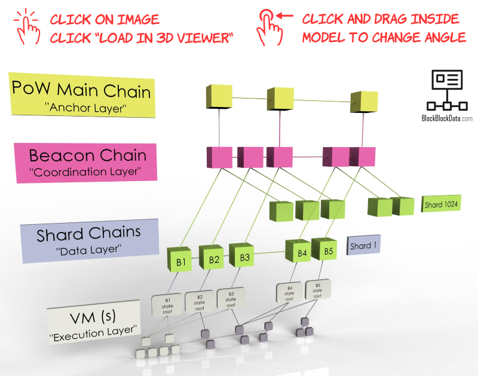

# The Ethereum 2.0 Beacon Block: A Data Schema and Visual Documentation

Gurdal Ertek, Joseph Kholodenko

**Summary:** Ethereum 2.0 is the new version of the Ethereum blockchain, where consensus (agreement of which data and blocks will be added) is to be achieved through proof-of-stake (PoS). 
Coordination of consensus and many other processes in Ethereum 2.0 will be carried out by a chain referred to as the "beacon chain".
There exists numerous comprehensive technical documentations of Ethereum 2.0 and the beacon chain. 
This article presents interactive visualizations and sample data to facilitate the understanding of data in the Beacon block.
As a methodological and pedagogical contribution, our article demonstrates how interactive 3D visualizations, data schema diagrams, and zoomable presentations can be applied to describe and communicate blockchain concepts and meta-data, not only for Ethereum, but for any blockchain.

> *"When I came up with Ethereum, my first first thought was, 'Okay, this thing is too good to be true.' As it turned out, the core Ethereum idea was good - fundamentally, completely sound."* ***Vitalik Buterin***


## Ethereum and Ethereum 2.0
Ethereum is the first [triple-entry ledger system](https://hackernoon.com/why-everyone-missed-the-most-important-invention-in-the-last-500-years-c90b0151c169) in human history to serve as an enabling platform for smart contracts and decentralized applications (dapps).
Ethereum 1.0, the Ethereum blockchain that achieves consensus through proof-of-work (PoW), is already the second most powerful computing platform on the face of earth.
The Ethereum Community and the Ethereum Foundation envison things to become much bigger. Exponentially bigger.

Yet, there is a roadblock. 
Ethereum 1.0 is also limited by the very PoW consensus protocol that makes it so much reliable and -almost unbreakably- robust: 
As of October 2020, the time of this article being written, transactions fees on the Ethereum blockchain network have become substantially higher than before, even doubling at one point the previous all-time-high (ATH) costs.
The bottleneck is the proof-of-work (PoW) protocol.

An existentially inevitable milestone in Ethereum's journey to become ["The Infinite Machine"](https://www.amazon.com/Infinite-Machine-Crypto-Hackers-Building-Internet/dp/B07XJ7WKXL/ref=sr_1_1?dchild=1&keywords=infinite+machine&qid=1602161947&s=books&sr=1-1) 
is Ethereum's version 2.0, , i.e, Ethereum 2.0. 
Upon the completion of the three Phases of Ethereum 2.0, namely Phase 0, Phase 1, and Phase 2, Ethereum blockchain will be fully functional without any dependence to any other "Layer 2" solution.

The focus of this article is the Beacon Block, a block on the beacon chain of Ethereum 2.0, which is to be introduced in Phase 0. 
Beacon chain is at the center of the Ethereum 2.0 network. Understanding the beacon chain is a critical step for any organization, team, or individual who plans to develop applications on Ethereum 2.0 or interact with it at code level.
Specifically, the article holds the magnifier on the beacon chain block, 

As of October 2020, Ethereum 2.0 is being tested on the Medalla testnet, which is to run for about three months, as well as other testnets that run over few days.

## Beacon Chain and Beacon Block

`
How to View & Interact: Click the "Load in 3D Viewer" link to view the visualization in 3D. 
Then click a point in the 3D visualization and drag to the left, right, up, and down to obtain the angle you wish to view from.
Click the plus (+) and minus (-) buttons on the right hand side of the window to zoom and unzoom.
`
<a href="https://grabcad.com/library/ethereum-2-0-blockchain-design-3d-visualization-v03m-1" target="_blank"></a>
https://grabcad.com/library/ethereum-2-0-blockchain-design-3d-visualization-v03m-1
Figure. Interactive 3D visualization of chains and sharding in Ethereum 2.0.

The Beacon chain can be thought of "the chain that rules them all", it is the chain within Ethereum 2.0 which is central to the system and its processes. 
As analogy, similar to how the spine of a human connects and holds together the body, the beacon chain will connect and hold together the many chains in Ethereum 2.0. 
Yet, unlike the spine of a human, which remains static, the beacon chain will over epochs of time, together with the other chains and components of the system.

Beacon chain is the focus and the ultimate deliverable of Phase 0 of Ethereum 2.0. In the latter Phases 1 and 2, other components of the system will be added. 
Yet, for other systems to operate successfully and integrate to the whole, the Beacon chain must be functioning flawlessly.

When Ethereum 2.0 becomes fully active, Beacon chain will perform the following critical functions:

## Medalla Testnet
Medalla is the final long-lasting testnet of Ethereum 2.0 Phase 0. 

The data schema that we present here represents the data that can be retrieved by [Lighthose https API](https://lighthouse-book.sigmaprime.io/http.html). 
While the Lighthouse API allows the retrieval of an extensive array of data, our focus in this article is the ['/beacon/block/ endpoint'](https://lighthouse-book.sigmaprime.io/http/beacon.html#beaconblock).
The Lighthouse API documentation also provides sample data, yet sample data is not complete for all the fields and data types.
A useful information available in our diagram is the parsing of the data in /beacon/block/ into tables of a relational database. 
The database schema also provides the [data types for MySQL](https://www.javatpoint.com/sql-data-types#:~:text=SQL%20Data%20Types%201%20String%20Data%20types%202,Data%20types%203%20Date%20and%20time%20Data%20types), 
the key attributes of each table, and the foreign keys that relate the tables to each other.
For the sake of simplicity, all bigint data types of Ethereum 2.0 have been represented as INT(255) and all hash strings -while many of them require much less memory- have been represented as TINYTEXT.

## Beacon Block Data Schema

`
How to View & Interact: Simply hold your mouse cursor over any connecting line. This will show the two fields at both ends of the relation. 
Use zooming feature and click and drag to focus on different areas of the diagram.
`

https://dbdiagram.io/d/5f6653cb7da1ea736e2e8295
Figure. Interactive data schema diagram (dbdiagram) for Ethereum 2.0 Beacon Block. 

The data schema visualization is interactive and is especially ideal for exploring the relations between the tables through foreign keys. 

The next visualization is a zoomable presentation, which shows different groups of related tables as a part of the whole. 
This presentation can help understand better the different groups of tables and the data fields in each table.


`
How to View & Interact:
Click on the play button in the intro screen. Then click the forward and back buttons at the bottom of the presentation. 
At any time, to return back to the main window, move the mouse cursor towards the middle right of the window, inside black area, until you see two buttons. 
Then, click the arrow button to return to main window.
`

https://prezi.com/p/z5sf3nyicten/?present=1
Figure. Zoomable data schema diagram with sample data. 


## Data Tables and Fields within Beacon Block

### Beacon Block 

``` javascript 
//***********************************************************
// sample block data from Medalla Testnet is block @ slot 139
Table beacon_block as bb {
root                   TINYTEXT  [pk, unique,                        note: 'ex: 0x2d424c3838d2b49d9c8da4e8297471f375b872ea4b250a75127e89175b44ba70']
slot                   INT(255)  [                                   note: 'ex: 139']
proposer_index         INT(255)  [ref: - validator.id,               note: 'ex: 2185']
parent_root            TINYTEXT  [ref: - beacon_block.root,          note: 'ex: 0x19c7252f6150f964fa62cc94e7ff9df79b74c552bf3d134b1f7a317c01662c1d']
state_root             TINYTEXT                                     [note: 'ex: 0xb9739996c890b47251eecab6643b7400ff992bf76ed75b26f0b04146ea4cd640']
randao_reveal          TINYTEXT                                     [note: 'ex: 0x820574e5514420659826e18b183d7d0478389bce4a08464427168c97e67884c5d38839675313688d4ada52259becb1a40b8ee7ccaf983c9ae56d69c0000a7114006c6bb640a515075b7610b8bdf21506d4146787550ddd89a5ed8956ce470bb6']
deposit_root           TINYTEXT                                     [note: 'ex: 0x53d90f778f975dcca3f30e072b5c1a85cfd7a1b977b78620d94f143d06432f9b']
deposit_count          TINYTEXT                                     [note: 'ex: 22637']
block_hash             TINYTEXT                                     [note: 'ex: 0xe0c057333355956e8fb8d88382f5676bbe083fbf8b978f0db719b4d02ae70777']
graffiti               TINYTEXT                                     [note: 'ex: 0x53746566616e2333393137000000000000000000000000000000000000000000']
proposer_slashings_id  INT(255) [ref: < proposer_slashings.id,       note: 'ex: '] 
attester_slashings_id  INT(255) [ref: < attester_slashings.id,       note: 'ex: '] 
attestations_id        INT(255) [ref: < attestations.id,             note: 'ex: ']
deposits_id            INT(255) [ref: < deposits.id,                 note: 'ex: ']
voluntary_exits_id     INT(255) [ref: < voluntary_exits.id,          note: 'ex: ']
signature              TINYTEXT                                     [note: 'ex: 0xaa4bba19b1c185002f446cc79e24bcf917808569394669b4fea9b855f2f49e6f76c2408384d8ded3d151ed5ab238951a137a777958525bdf58c6fa75d6418ae4f5e67177747040919f81a86a1065355b2d1abb1553bc94630a6c06e4a67e5fe4']
}
``` 

While the Lighthouse http API enables the extraction of detailed data about validators, the `/beacon/block/` endnode does not give any information.

``` javascript 
//***********************************************************
// for now, validator is presented only as a value, the proposer to block @ slot 139 is taken as example
Table validator {
id                     INT(255) [pk,                                 note: 'ex: 2185']
}
```

https://www.dbml.org/docs/

### Proposer Slashings


``` javascript 
//***********************************************************
// sample block data from Medalla Testnet is block @ slot 139
Table proposer_slashings {
id                     INT(255) [pk, increment,                      note: 'ex: ']
proposer_slashing_index  INT(255) [pk,                               note: 'ex: 1']
proposer_slashing_id     INT(255) [ref: - proposer_slashing.id,      note: 'ex: ']
}

Table proposer_slashing {
id                     INT(255) [pk, increment,                      note: 'ex: ']
signed_header_1        INT(255) [ref: - signed_header.id,            note: 'ex: ']
signed_header_2        INT(255) [ref: - signed_header.id,            note: 'ex: ']
}

Table signed_header {
id                     INT(255) [pk, increment,                      note: 'ex: ']
slot                   INT(255) [ref: > beacon_block.slot,           note: 'ex: 138']
proposer_index         INT(255) [ref: > validator.id,                note: 'ex: 2329']
parent_root            TINYTEXT [ref: > beacon_block.root,           note: 'ex: 0x9ad72edd1303a10d292bf8ad84360d30b309a85fd0ee9f4143821f5a3ec01da1']
state_root             TINYTEXT                                     [note: 'ex: 0x1b067135c44e9b472608a58499f7e13561dbc0f4fd9ae3ebd9f6ddae298cebbe']
body_root              TINYTEXT [ref: > beacon_block.root,           note: 'ex: 0xa9905d68bfe2f4bde96020c4a5b66b62ef575b8c5096bbf5d042ee4795f13f80']
signature              TINYTEXT                                     [note: 'ex: 0xa5e55750045079ee500ce6176c3ea83ae1ceb415357e6019a43641cf15a961bc7cc799923a1b0d019be0a6c6138b89e7025a57cedabbd262ceefe44931052b083e99d92624a91ace8f16acd6647f7234391df2e3e3f77a68816072793e8a718d']
}
```

### Attester Slashings

``` javascript 
//***********************************************************
// sample block data from Medalla Testnet is block @ slot 688
Table attester_slashings {
id                     INT(255) [pk, increment,                      note: 'ex: ']
attester_slashing_index  INT(255) [pk,                               note: 'ex: ']
attester_slashing_id     INT(255) [ref: - attester_slashing.id,      note: 'ex: ']
}

Table attester_slashing {
id                     INT(255) [pk, increment,                      note: 'ex: ']
attestation_1          INT(255) [ref: < attestation.id,              note: 'ex: ']
attestation_2          INT(255) [ref: < attestation.id,              note: 'ex: ']
}

Table attestation {
id                     INT(255) [pk, increment,                      note: 'ex: ']
attesting_indices_id   INT(255) [pk, ref: < attesting_indices.id,    note: 'ex: ']
slot                   INT(255) [ref: - beacon_block.slot,           note: 'ex: 654']
index                  INT(255)                                     [note: 'ex: 0']
beacon_block_root      TINYTEXT [ref: > beacon_block.root,           note: 'ex: 0x69f3e09fa4fdc8b6e6162588a488606175069c396d215d44f0a8fb7565d911e4']
source_epoch           INT(255)                                     [note: 'ex: 19']
source_root            TINYTEXT [ref: > beacon_block.root,           note: 'ex: 0xf7f25edf9ead6eaf17d1dfaa4c3259dcc3d4897986fa4141577695793b90240f']
target_epoch           INT(255)                                     [note: 'ex: 20']
target_root            TINYTEXT [ref: > beacon_block.root,           note: 'ex: 0x9f3af8c4ef4b38e82617e1d82ca868f785d015a2de45e112a398f6748ea4d6dc']
signature              TINYTEXT                                     [note: 'ex: 0xb2883dffd3fd8668e410d55915ee5e72dd08a423a2c28033adec54f0178062ea9ac3f47fa0ef952ae50494c9705b911215d8c5c9da5619760004f59c09a58077eb0ba6fb2fd2135265b465d27be536eeabd40bb61df4742a438c7e6723b6c18a']
}

Table attesting_indices {
id                     INT(255) [pk, increment,                      note: 'ex: ']
attesting_indices_index  INT(255) [pk,                               note: 'ex: 1']
validator              INT(255) [ref: > validator.id,                note: 'ex: 183']
}
``` 

### Attestations

``` javascript 
//***********************************************************
// sample block data from Medalla Testnet is block @ slot 688
Table attestations {
id                     INT(255) [pk, increment,                       note: 'ex: ']
aggregation_index      INT(255) [pk,                                  note: 'ex: 1']
aggregation_bits_hash  TINYTEXT [ref: - aggregation_bits.hash,        note: 'ex: 0xb37e736f29efcf36febf7dd2defde6f1f38d5e2d']
}

Table aggregation_bits {
hash                   TINYTEXT [pk, unique,                          note: 'ex: 0xb37e736f29efcf36febf7dd2defde6f1f38d5e2d']
slot                   INT(255) [ref: > beacon_block.slot,            note: 'ex: 671']
index                  INT(255) [pk,                                  note: 'ex: 1']
beacon_block_root      TINYTEXT [ref: > beacon_block.root,            note: 'ex: 0x99ad36b7c857c00c461987fca2230723a31606fb8deb7686f7ba861f0bd0761c']
source_epoch           INT(255) [                                     note: 'ex: 19']      
source_root            TINYTEXT [ref: > beacon_block.root,            note: 'ex: 0xf7f25edf9ead6eaf17d1dfaa4c3259dcc3d4897986fa4141577695793b90240f']    
target_epoch           INT(255) [                                     note: 'ex: 20']  
target_root            TINYTEXT [ref: > beacon_block.root,            note: 'ex: 0x9f3af8c4ef4b38e82617e1d82ca868f785d015a2de45e112a398f6748ea4d6dc']
signature              TINYTEXT                                      [note: 'ex: 0x877743855735e76201f9bfd539140ea49240d9d532f89b6024f3b62fc235a62efecb1642a12698654c09b433a4f4212b01f294b6bc12f9f59450acef2540596a3f3749b4617acceee1641105dd4060139768b5b7b776a773d6ed71dd0d45c958']
}
``` 

### Deposits

``` javascript 
//***********************************************************
// sample block data from Medalla Testnet is block @ slot 1005
Table deposits {
id                    INT(255) [pk, increment,                       note: 'ex: ']
deposit_index         INT(255) [pk,                                  note: 'ex: ']
deposit_id            INT(255) [ref: - deposit.id,                   note: 'ex: ']
}

Table deposit {
id                    INT(255) [pk, increment,                       note: 'ex: ']
proofs_id             INT(255) [ref: < proofs.id,                    note: 'ex: ']
pubkey                TINYTEXT                                      [note: 'ex: 0xa0d46f3e977da3c53d46dcff9a4f7e6b4895cf9fb66ea76d82fd5462d3ed32c378d733017640dfaa2a9012de7a71d9b9'] 
withdrawal_credentials  TINYTEXT                                    [note: 'ex: 0x00f51a03211451f1cbb0a6b609cfefdb777b837e33442141cae67ff4b9297a6f'] 
amount                INT(255) [ref: < proofs.id,                    note: 'ex: 32000000000']
signature             TINYTEXT                                      [note: 'ex: 0x96155845317fcd242b38051dc873b6614601daf997691454c28d882df5b2086dde861b2357b773d2f2a9a8487296306f03269fade98b4610dbabfdbc70aba26485fa2519b55c22629aad4e93e7dd1bb1e16a80d1dc9c896134f01029540bfa69']
}

Table proofs {
id                    INT(255) [pk, increment,                       note: 'ex: ']
proof_index           INT(255) [pk,                                  note: 'ex: 1']
proof_hash            TINYTEXT                                      [note: 'ex: 0x1a681904fc274c629c0fe89054b8e15db5717e54bad61bed3ef2b0cced8772f3']
}
``` 

### Voluntary Exits

``` javascript 
//***********************************************************
// sample block data from Medalla Testnet is block @ slot 29758
Table voluntary_exits {
id                     INT(255) [pk, increment,                      note: 'ex: ']
voluntary_exit_index   INT(255) [pk,                                 note: 'ex: 1']
voluntary_exit_id      INT(255) [ref: < voluntary_exit.id,           note: 'ex: ']
}

Table voluntary_exit {
id                     INT(255) [pk, increment,                      note: 'ex: ']
epoch                  INT(255) [                                    note: 'ex: 929']
validator_index        INT(255) [ref: > validator.id,                note: 'ex: 5194']
signature              TINYTEXT                                     [note: 'ex: 0x93f39045a23a8fd9818cbc0514a678415d8af96fb8f81322d4615c7398efc8a0835576aa7924be089a424ea0be1ea6470e732c3c62ac71c600981c90f7a1fe6d2856b7fa18afb46559fc449f0237bd6b07c368fefcf31ed6c5118aaefbaa7b47']
}
``` 

## 

**Gürdal Ertek** is an Associate Professor at UAE University (UAEU), Al Ain, UAE. He received his Ph.D. from Georgia Institute of Technology, Atlanta, GA, in 2001. Dr. Ertek served in educational and research organizations in Turkey, USA, Singapore, Kuwait and UAE, as well as an on-site reviewer for 50+ industrial R&D projects. His research and teaching areas include applied data science, business analytics, supply chain management, project management, and R&D management.

**Joseph Kholodenko** is a freelance data science consultant. In the past he has worked as a Data Scientist at Google and taught at the Flatiron School as a Senior Lead Data Science Instructor. He is currently pursuing his MS in Computer Science with a specialization in machine learning at Georgia Institute of Technology.

