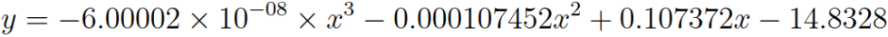

# An Analysis of Data Propogation Latencies in the Ethereum 2.0 Medalla Testnet

**Joseph Kholodenko, Gurdal Ertek**

**Summary:** 

Ethereum 2.0 is the new version of the Ethereum blockchain, where consensus (agreement of which data and blocks are to be be added) is to be achieved through proof-of-stake (PoS) consensys protocol. 
Coordination of consensus and many other processes in Ethereum 2.0 will be carried out by a chain referred to as the *beacon chain*. The beacon chain which processes and immutable writes on the blockchain various types of data, including proposers, attestations, slashings, deposits, and voluntary exits.
The Medalla testnet of the the Ethereum 2.0 network provides ample data, which can be analyzed for measuring and improving the performance of the network.

An important performance metric category is *data propogation latency*, which refers to the latency (delay) in propogating data on the network, as the  immutably including/writing/recording of the data on the chain as the final output.
This article presents a visual analysis of data propogation latencies (delays) in the Medalla testnet, focusing on the *average inclusion distances (delays, latencies)* in each epoch for attestations. 

As a methodological contribution, our article demonstrates how latency data can be visually and statistically analyzed. The data analytics methodology presented here can be applied not only in analyzing data from the Ethereum 2.0 mainnet, but also for analyzing data from any blockchain network.

As a practical contribution, our research reveals several insights (at epoch granularity) that can be further investigated for improving the data propogation performance of Ethereum 2.0: (1) The average vs. standard deviation of attestation inclusion distance are inversely associated. (2) Committee size is associated with average inclusion distance. (3) Voluntary exits are positively associated with  average inclusion distance. 

> *"Every second is of infinite value."* ***Johann Wolfgang von Goethe***


Photo by <a href="https://unsplash.com/@aronvisuals?utm_source=unsplash&amp;utm_medium=referral&amp;utm_content=creditCopyText">Aron Visuals</a> on <a href="https://unsplash.com/s/photos/time?utm_source=unsplash&amp;utm_medium=referral&amp;utm_content=creditCopyText">Unsplash</a>

## Ethereum and Ethereum 2.0
The Ethereum blockchain, initially envisioned by [Vitalik Buterin](https://medium.com/@VitalikButerin), is the first [triple-entry ledger system](https://hackernoon.com/why-everyone-missed-the-most-important-invention-in-the-last-500-years-c90b0151c169) in human history to serve as an enabling platform for smart contracts.
Ethereum 1.0, the Ethereum blockchain that achieves consensus through proof-of-work (PoW), is already the second most powerful computing platform on the face of earth.

An existentially inevitable milestone in Ethereum's journey to become ["The Infinite Machine"](https://www.amazon.com/Infinite-Machine-Crypto-Hackers-Building-Internet/dp/B07XJ7WKXL/ref=sr_1_1?dchild=1&keywords=infinite+machine&qid=1602161947&s=books&sr=1-1) 
is Ethereum's version 2.0, , i.e, Ethereum 2.0. 
Upon the completion of the three Phases of Ethereum 2.0, namely Phase 0, Phase 1, and Phase 2, Ethereum blockchain will be fully functional, achieving security *and* scalability. A comprehensive list of resources on Ethereum 2.0 can be found [here](https://hackmd.io/@benjaminion/eth2_info).

The topic of this article is data propogation latencies, i.e., delays in propagating and including/writing/recording data, on the [beacon chain](https://blockblockdata.github.io/medalla-data-challenge/a001/the_ethereum_2_beacon_block_data_schema_and_visual_documentation.html), the primary chain within Ethereum 2.0, to go live with Phase 0. Specifically, the focus is the delays in the inclusion of attestation aggregations on Ethereum 2.0's beacon chain.
The analysis of data propogation latencies is a [high priority](https://www.notion.so/Wishlist-The-Eth2-Medalla-Data-Challenge-69fe10ffe83748bc87faa0e2586ba857) analysis, that can help improve the performance of the network. 
The data schema for the database is provided [here](https://github.com/pintail-xyz/medalla_analysis/blob/master/schemas).

While the analysis in this article focuses on data from the Medalla testnet of Ethereum 2.0, the presented visual analytics methodology, as well as [analysis methodologies by other researchers,](https://pintail.xyz/) can serve as a guiding example of how blockchain network data can be analyzed by blockchain engineers, auditors, and data engineers/scientists.

## Beacon Chain and Attestations
Ethereum 2.0's architectural design has at its core the *beacon chain*, which coordinates the Proof-of-Staking (PoS) consensus protocol. An [insightful article by Ben Edgington](https://media.consensys.net/state-of-ethereum-protocol-2-the-beacon-chain-c6b6a9a69129) explains the functionality and working mechanism of the beacon chain. In [an earlier article]([beacon chain](https://blockblockdata.github.io/medalla-data-challenge/a001/the_ethereum_2_beacon_block_data_schema_and_visual_documentation.html) that we prepared for submission to the [Medalla Data Challenge](https://blockblockdata.github.io/medalla-data-challenge/a001/the_ethereum_2_beacon_block_data_schema_and_visual_documentation.html), we provide a visual documentation of the data produced and stored for each beacon block of the beacon chain. As further reference, an excellent list of definitions for the various Ethereum 2.0 terms can be found from [this Alethio article](https://medium.com/alethio/ethereum-2-a-validators-journey-through-the-beacon-chain-843f70aaab2e). 

Before proceeding further, let us review some basic terminology for Ethereum 2.0, in relation to the PoS consensus process [(Source)](https://blockblockdata.github.io/medalla-data-challenge/a001/the_ethereum_2_beacon_block_data_schema_and_visual_documentation.html):

- The atomic time unit in Ethereum 2.0 is a *slot*, which is issued every 12 seconds. 
- Every slot can accomodate at most one data block. Every 32 slots (about 6,5 minutes) constitute an *epoch*.  
- Consensus on the Ethereum 2.0 blockchain will be achieved through the participation of *validators*, which are in essence client software running in parallel on a distributed network of computers. 
- The [journey of a validator](https://medium.com/alethio/ethereum-2-a-validators-journey-through-the-beacon-chain-843f70aaab2e) begins by the installation of the client software, deposit of at least 32 ETH (Ethereum) coins to the node's wallet, and joining a waiting queue to be admitted. 
- Once a validator is admitted, at each slot, there are two main roles that it may be assigned to by the network, namely role of *(block) proposer* and the role of *(block) attester*. A proposer (a validator with the proposer hat on) proposes blocks to be added to the blockchain. 
- An attester (a validator with the attestor hat on) votes on whether the block is valid and should be appended to the network, as the proposer suggests. 
- Attesters vote within one of multiple *committees*, where committees are formed freshly at every epoch. 
- Each validator is invited every epoch exactly once to serve in one of the many committees. 
- The Ethereum 2.0 network incentivizes compliant behavior on the part of the validators through various [rewards and penalties](https://codefi.consensys.net/blog/rewards-and-penalties-on-ethereum-20-phase-0), while keeping them in the network. 
- If a validator, in the role of proposer *or* attester, is proven to commit fraud, it is *slashed*, meaning that it is involuntarily and forcefully removed by the system from the network. 
- Slashed validator are *not* allowed to participate in the network again.

While many details exits, we refer interested readers to two fascinating articles by [Ben Edgington](https://media.consensys.net/state-of-ethereum-protocol-2-the-beacon-chain-c6b6a9a69129) and [Jim McDonald](https://www.attestant.io/posts/understanding-the-validator-lifecycle/) which describe the working mechanics of the beacon chain and Ethereum 2.0 overall. 

Ethereum 2.0's Proof-of-Stake (PoS) consensus protocol includes/writes/records blocks on the blockchain not simultaneously, but only after evaluating *attestations*, which are aggregated as *attestation aggregations*. For each slot, the attestations from different committees are *included* in the blockchain only after a certain delay, which can be referred to as *inclusion distance (inclusion delay, inclusion latency, or other similar term)*. 

In this article, in contrast to the [amazing analyses and articles by pintail](https://pintail.xyz), from now on, we will refer to this latency as *inclusion distance*. The block for a slot is immutably written/registered as soon as the first inclusion is done. Even though the Ethereum 2.0 network finalizes a block for a given slot (as soon as the first inclusion is completed), the computations still continue until the last inclusion slot. In our analysis, for each slot, the inclusion distance is defined as the maximum inclusion distance over all attestation aggregations, and over all committees that participated in the voting for that slot. In other words, our definition of "inclusion distance" is in a way equivalent to "maximum inclusion distance".

While this metric is not directly measuring the time until the actual inclusion (which takes place with the first inclusion), it instead measures the computational workload on the system spent on attestations and inclusions.

## Data Extraction

Our analysis is built on data from the Medalla testnet extracted using [`chaind` API](https://github.com/wealdtech/chaind) and shared in the form of an PostgreSQL dump, whose latest version can be [accessed from here](http://mdc.mcdee.net/chain-487600.dmp). The data was kindly shared by [Jim McDonald](https://github.com/mcdee?tab=overview&from=2014-12-01&to=2014-12-31) on [ethstaker Discord channel, under #medalla-data-challenge group](https://discord.com/channels/694822223575384095/752638638189445220). 

We run 2 basic queries where is row in the extracted data corresponds to a slot. The first query given below extracts from `t_attestations table`, and returns the minimum and maximum inclusion slots (`min_inc_slot_over_committees` and `min_inc_slot_over_committees`, respectively) over all committees, and then takes their difference `slot_diff_over_committees` as the actual inclusion distance for that slot. While other data was also extracted regarding each epoch, eventually we used only the data from the fields `f_slot ` (which we refer to as Slot in our analysis) and `slot_diff_over_committees` (which we refer to as `InclusionDistance`).

The first query is as follows:

``` javascript
SELECT
  f_slot,
  MIN(f_inclusion_slot) AS min_inc_slot_over_committees,
  MAX(f_inclusion_slot) AS max_inc_slot_over_committees,
  MAX(f_inclusion_slot) - f_slot AS slot_diff_over_committees,
  MIN(f_source_epoch) AS min_src_epoch,  
  MAX(f_target_epoch) AS max_targ_epoch,
  MAX(f_target_epoch) - MIN(f_source_epoch) AS epoch_diff_over_committees
FROM
  t_attestations
GROUP BY
  1
;
``` 

The second query extracts data from multiple tables, namely `t_blocks`, `t_proposer_slashings`, `t_attester_slashings`, and `t_voluntary_exits`.
Again, each record (row) corresponds to a slot. 
The extracted records have as fields the proposer for that slot, as well as the binary attributes that denote the presence/absence of attestations, slashings, and voluntary exits. 
Rows with `null` values for slashings were assumed to be slots with missing blocks.

The second query is as follows:

``` javascript
SELECT
  f_proposer_index,
  f_root,
  f_slot,
  CASE WHEN f_slot IN (SELECT f_inclusion_slot FROM t_proposer_slashings) THEN 1 ELSE 0 END AS proposer_slashings,
  CASE WHEN f_slot IN (SELECT f_inclusion_slot FROM t_attester_slashings) THEN 1 ELSE 0 END AS attester_slashings,
  CASE WHEN f_slot IN (SELECT f_inclusion_slot FROM t_voluntary_exits) THEN 1 ELSE 0 END AS voluntary_exits,
  ps.f_header_1_slot AS ps_header_1_slot,
  ps.f_header_1_proposer_index AS header_1_proposer_index,
  ps.f_header_2_slot AS ps_f_header_2_slot,
  ps.f_header_2_proposer_index AS header_2_proposer_index,
  b.f_slot - ps.f_header_1_slot AS delay_reporting_proposer_slashings,
  atts.f_attestation_1_slot AS atts_slot_1,
  atts.f_attestation_2_slot AS atts_slot_2,
  atts.f_attestation_2_slot - atts.f_attestation_1_slot AS delay_atts_committees,
  b.f_slot - atts.f_attestation_1_slot AS delay_reporting_atts_1_slashings,
  b.f_slot - atts.f_attestation_2_slot AS delay_reporting_atts_2_slashings,
  atts.f_attestation_1_source_epoch AS atts_1_source_epoch,
  atts.f_attestation_1_target_epoch AS atts_1_target_epoch,
  atts.f_attestation_2_source_epoch AS atts_2_source_epoch,
  atts.f_attestation_2_target_epoch AS atts_2_target_epoch,
  ve.f_validator_index AS ve_index,
  ve.f_epoch AS ve_epoch,
  ve.f_inclusion_slot AS ve_slots,
  b.f_slot - ve.f_inclusion_slot AS delay_reporting_ve
FROM
  t_blocks b
LEFT JOIN
  t_proposer_slashings ps
ON
  b.f_slot = ps.f_inclusion_slot
LEFT JOIN
  t_attester_slashings atts
ON
  b.f_slot = atts.f_inclusion_slot
LEFT JOIN
  t_voluntary_exits ve
ON
  b.f_slot = ve.f_inclusion_slot
;
``` 

## Data Preparation

After the execution of the above two queries and extraction of data as records in two separate output tables, the results were then merged in a single table using a Google Sheet and the VLOOKUP function. We observed that analysis at the slot granularity could be misleading due to high variability. Therefore, we decided to continue with analyzing data at epoch granularity. Another observation was that for earlier epochs, inclusion distance and other data propogation metrics had reached to unreasonably high values. The same observation was reported in a [related research]( https://pintail.xyz/posts/medalla-network-stress/). In turn, we decided to remove earlier epochs from our analysis and only focus on epoch 5000 onwards. 

Eventually, the data used in our analysis was as follows:


## Univariate Analysis

The figures below provide univariate histogram analyses of average inclusion distance `InclusionDistanceAvg` and number of missing blocks `MissingBlocks` per epoch. *Beta* distribution was calculated to be a good fit for representing the statistical distribution of both attributes. In Ethereum 2.0, attestations for each slot must be completed within no later than 32 slots, implying that inclusion distance for each slot can be have a maximum value of 32 (slots). Therefore, given this upper limit for inclusion distance, the distribution of average inclusion distance is not symmetric. Regarding the number of missing blocks, While *Beta* distribution closely fits the histogram, the distribution is fairly symmetric. It was insightful for us to observe that the distribution is centered around the value of 6, which translates into approximately 20% of slots in an epoch with no blocks written for.  This could be an avenue for improvement in the future for Ethereum 2.0.


## Correlations

The next analysis was the correlation matrix , where strong positive correlations were identified between multiple attribute pairs, with highest correlation values for (`InclusionDistanceAvg`, `Epoch`), (`InclusionDistanceAvg`, `NoOfCommittees`), and (`InclusionDistanceAvg`, `InclusionDistanceStdDev`). Observing these high correlations guided our visual analysis, resulting in insights some of which are also statistically supported.


## Patterns Over Epochs

The next analysis, where the number of committees is plotted against epoch, shows the number of committees `NoOfCommittees` in each epoch is a monotonically increasing step function of `Epoch`. 


The analysis of inclusion distance over epochs, as provided below, of time suggests that there may be trends overtime for both the average and standard deviation.


The next figure, which shows the number of `AttesterSlashings` per epoch, suggests that there were a maximum of 5 attester slashings in an epoch, with most epochs (with slashings) having only one slashing. 


The next figure, which shows the number of `VoluntaryExits` per `Epoch`, suggests that there were a maximum of 22 voluntary exits in an epoch, with most epochs (with voluntary exits) having only *multiple* voluntary exits. It is also observeable from the figure that three different time intervals (distinguished by tall stacks of circular glyphs) witness visibly more voluntary exits compared to the remaining time intervals where there were no voluntary exits (distinguished by thick horizontal stack of glyphs with 0 voluntary exits). This, in our opinion, is a phenomenon that deserves a careful attention. What could be the underlying reason for certain brief time intervals with many voluntary exits? What happened in each of those time intervals to cause such high number of voluntary exits?


The next figure, which shows the number of missing blocks per epoch, does not suggest any trend over time.


## Relationships Between Attributes

The next figure, which plots inclusion distance standard deviation against inclusion distance average, clearly shows an inverse relationship between the two have attributes/metrics.


The next figure, which plots only the observations with average inclusion distance average greater than 14. The scatter plot and the successive trend analysis  suggest a polynomial functional form that can model the relationship between the two attributes. The fitted polynomial function is provided right below the figure. *x* is the attribute (`InclusionDistanceAvg`) on the *x* axis and *y* is the attribute (`InclusionDistanceStdDev`) on the *y* axis.


<!-- y = -0.000359748 x^3 + 0.00293036 x^2 + -0.0531494 x + 11.027  -->

The next figure, which plots average inclusion distance `InclusionDistanceAvg` against the jittered values of number of committees `NoOfCommittess-Jittered`. As evident from the attribute name, the values on the x axis are jittered to enable better insights. The scatter plot and the successive trend analysis suggest a polynomial functional form that can model the relationship between the two attributes. The fitted polynomial function is provided right below the figure. Yet, it should be noted that this curve, suggested by Tableau software, is based on the jittered values of `NoOfCommittees`, and hence is not accurate. *x* is the attribute (`NoOfCommittees-Jittered`) on the *x* axis and *y* is the attribute (`InclusionDistanceAvg`) on the *y* axis.


<!-- y = -3.324e-07 x^3 + 0.000627697 x^2 + -0.337291 x + 78.0857  -->

The scatter plot and the fitted function in the above figure suggest differences in mean `InclusionDistanceAvg` values across different values of `NoOfCommittees`. To this end, box plots have been drawn, where the dependent variable/attribute is `InclusionDistanceAvg` and the categorical independent variable/attribute is `NoOfCommittees` (the box plot on the left hand side below).


Since the box plots make the differences in means even more visible, as the next step, formal hypothesis testing has been conducted. The null hypothesis is that the mean `InclusionDistanceAvg` values across different values of `NoOfCommittees` are equal across each pair of values of `NoOfCommittees` (ex: (256, 288)). The alternative hypothesis is that there are statistically significant differences in means. Since at least one of the subsamples is *not* normally distributed, the non-parametric [Dunn test with Bonferroni correction](https://www.statology.org/dunns-test/) is a suitable test. The table below shows the results of Dunn test obtained using [Python's scikit library](https://scikit-posthocs.readthedocs.io/en/latest/generated/scikit_posthocs.posthoc_dunn/), with a threshold *p*-value of 0.01. 

- Any pairwise test result with *p*-value < 0.01 is indicated in the below matrix with a value of 1. 
- Light blue color denotes the pairs where the subsample in the row has *higher* mean values of `InclusionDistanceAvg` than the subsample in the column. For example, when `NoOfCommittees` is 384, the mean `InclusionDistanceAvg` is greater than the mean for `NoOfCommittees` being 416. 
- Light red color denotes the pairs where the subsample in the row has *lower* mean values of `InclusionDistanceAvg` than the subsample in the column. For example, when `NoOfCommittees` is 352, the mean `InclusionDistanceAvg` is less than the mean for `NoOfCommittees` being 448. 


Since it may not be straightforward to visually observe stochastic dominance patterns from the table, we apply the [graph-based methodology of Ertek et al. (2019)](https://ertekprojects.com/gurdal-ertek-publications/graph-based-visualization-of-stochastic-dominance-in-statistical-comparisons/) to visualize the Dunn test results: 

- Each discrete value of the categorical independent variable/attribute `NoOfCommittees` is shown by a node (rectangles).
- Each value of 1 in the Dunn test results matrix is represented by an arc (arrow). 
- Direction of the arc (arrow) denotes which subsample has higher mean values. If the value of 1 is in a light blue cell, than the direction of the arrow is from the subsample in the row to the subsample in the column.
- After the graph is constructed, the hierarchical layout algorithm with mostly default parameters was run to generate the final graph visualization.

The [yEd graph drawing software](https://www.yworks.com/products/yed) by [yWorks](http://yworks.com) was used to create the graph:


From the graph, it can be seen that when `NoOfCommittees` is 256, `InclusionDistanceAvg` takes the largest values with statistical significance. Therefore, ceteris paribus (all else being unchanged), this value as the `NoOfCommittees` (which translates into 256/32=8 committees per slot throughout the epoch) does *not* seem favorable. On the other hand, `NoOfCommittees` being 352 (which translates into 11 committees per slot throughout the epoch) seems to give the least `InclusionDistanceAvg`. Therefore, the value of 11 seem favorable as the number of committees per slot, throughout the epoch. Yet, there are certain other considerations, such as the committee sizes and the epoch, to be taken into account before a solid recommendation. Actually, these three are all tied to each other, because each validator is expected to serve as [attester exactly once in each epoch](https://www.attestant.io/posts/defining-attestation-effectiveness/). Still, we *can* conclude that *committee size is associated with inclusion distance*.

Similar to the analysis of `InclusionDistanceAvg` against the `NoOfCommittees`, a similar analysis was conducted for `InclusionDistanceStdDev`, whose scatter plot and  best-fit polynomial function are provided below. Due to space considerations, the full analysis on this is not included in the article.




<!-- y = -6.00002 \times 10^{-08} \times x^3 -0.000107452 x^2 + 0.107372 x -14.8328  -->

The very last analysis of this article is for voluntary exits. For this analysis, firstly, we plotted `InclusionDistanceAvg` and `InclusionDistanceStdDev` against `VoluntaryExits` (per epoch):


The figure contians two visible patterns: 
- When there are one or more voluntary exits within an epoch, the average inclusion distance `InclusionDistanceAvg` seems to take larger values, mostly *above* the `Average` line. 
- On the other hand, under same circumstances, the standard deviation of the inclusion distance `InclusionDistanceStdDev` seems to take larger values, mostly *below* the `Average` line. 

Our earlier analysis revealed an inverse relation between  `InclusionDistanceAvg` and  `InclusionDistanceStdDev`; thus, it is enough to focus only one of these results. Without loss of generality, we focused on the first observation and conduct formal statistical hypothesis testing. 

In order to be able to decide whether we could use parametric tests, we conducted Shapiro-Wilk test of normality. At threshold *p*-value of 0.01, for one of the subsamples (corresponding to the case where there are one or more voluntary exits), the null hypothesis for normality was rejected. Therefore, we continued with non-parametric Mann Whitney U test for comparison of sample means between two samples. 

Mann Whitney U test gave *p*-value < 0.01, thus the null hypothesis (that the two samples have the same mean) was rejected. 
The randomly selected `InclusionDistanceAvg` value of the first population (no voluntary exits) is considered to be *not* equal to the randomly selected `InclusionDistanceAvg` value of the second population (at least one voluntary exit). Therefore, we can conclude that *voluntary exits are positively associated with  average inclusion distance*.

## Final Words

Combining visual analytics and statistical methods, our research presented in this article brings fresh insights into data propogation delays,  specifically into *attestation inclusion distances*, in Ethereum 2.0's Medalla testnet. As a methodological contribution, our article demonstrates how latency data can be visually and statistically analyzed through an integrated workflow. The data analytics methodology presented here can be applied not only in analyzing data from the Ethereum 2.0 mainnet, but also for analyzing data from any blockchain network.
As a practical contribution, our research reveals several insights (at epoch granularity) that can be further investigated for improving the data propogation performance of Ethereum 2.0.

## Acknowledgements

We thank the authors of all the resources used in the article, as well as the Ethereum Community and Foundation. We especially thank [Jim McDonald](https://www.linkedin.com/in/jimgmcdonald/) for sharing the data used in the article and answering our many questions, [Ben Eddington](https://www.linkedin.com/in/benedgington/) for his rigorous documentation, [pintail](https://pintail.xyz) for openly sharing his analysis with the ethstaker community, and [Butta.eth](https://twitter.com/Butta_eth) for answering our questions on ethstaker. We also thank [Ivan Liljeqvist](https://www.linkedin.com/in/ivan-liljeqvist-697824198/) and the [Ivan on Tech](https://academy.ivanontech.com/a/27786/pVrJMEtL) team for creating a thriving community and motivating blockchain content. 


## Sign up to receive updates and analyses from us in the future:

<form action="https://formspree.io/f/xleojqvv" method="post">
  <label for="email">Your Email</label>
  <input name="Email" id="email" type="email">
  <button type="submit">Submit</button>
</form>

## Authors

<table>
  <tr>
    <td width=150px><a href="https://www.linkedin.com/in/josephkholodenko/" target="_blank"></a></td>
    <td><b>Joseph Kholodenko</b> is a freelance data science consultant. In the past he has worked as a Data Scientist at Google and taught at the Flatiron School as a Senior Lead Data Science Instructor. He is currently pursuing his MS in Computer Science with a specialization in machine learning at Georgia Institute of Technology.
    </td>
  </tr>
  <tr>
    <td width=150px><a href="https://www.linkedin.com/in/gurdalertek/" target="_blank"></a></td>
    <td><b>Gürdal Ertek</b> is an Associate Professor at UAE University (UAEU), Al Ain, UAE. He received his Ph.D. from Georgia Institute of Technology, Atlanta, GA, in 2001. Dr. Ertek served in educational and research organizations in Turkey, USA, Singapore, Kuwait and UAE, as well as an on-site reviewer for 50+ industrial R&D projects. His research and teaching areas include applied data science, business analytics, supply chain management, project management, and R&D management. Dr. Ertek's research and other work can be accessed through <a href="http://ertekprojects.com" target="_blank">ErtekProjects.com</a> </td>
  </tr>
</table>


## APPENDIX: Software Stack & Tools

- Data Extraction
  - [PostgreSQL](https://www.postgresql.org/) for opening the database dump provided by Jim McDonald
  - [SQL](https://www.amazon.com/Learning-SQL-Generate-Manipulate-Retrieve/dp/1492057614) language for querying the data in PostgreSQL and exporting csv files

- Data Preparation
  - [Google Sheets](https://www.google.com/sheets/about/) for merging data from multiple SQL queries scalably on the cloud
  - [MS Excel](https://www.youtube.com/channel/UCJtUOos_MwJa_Ewii-R3cJA) for cleaning, adding new derived attributes, adding new attributes with jittering, and pivot analysis

- Univariate Analysis & Correlations
  - [Orange](https://orange.biolab.si/) data mining software

- Patterns Over Epochs & Relationships Between Attributes
  - [Tableau](https://www.tableau.com) visual analytics software for generating visualizations and computing best-fitting nonlinear regression function (polynomial functional form)
  - [seaborn library for Python](https://seaborn.pydata.org/) for drawing the box plots
  - [scikit library for Python](https://scikit-posthocs.readthedocs.io/en/latest/generated/scikit_posthocs.posthoc_dunn/) for conducting the Dunn tests
  - [yEd graph drawing software](https://www.yworks.com/products/yed) by [yWorks](http://yworks.com) for creating and visualizing the graph that displays Dunn test results
  - [Stats Kingdom](https://www.statskingdom.com) online service for conducting Shapiro-Wilk test of normality and Mann-Whitney two sample test

- Other
  - [Pdf-XChange Viewer](https://www.tracker-software.com/product/pdf-xchange-viewer) pdf editor for generating high resolution images from the pdf output of the data schema diagram
  - [Codecogs.com](https://www.codecogs.com/latex/eqneditor.php) Online LaTeX Equation Editor for generating formula images from LaTex code
  - [Paint.net](https://www.getpaint.net/index.html) image editor for editing the images
  - [Markdown language](https://guides.github.com/features/mastering-markdown/) within GitHub for generating the html code for the web

