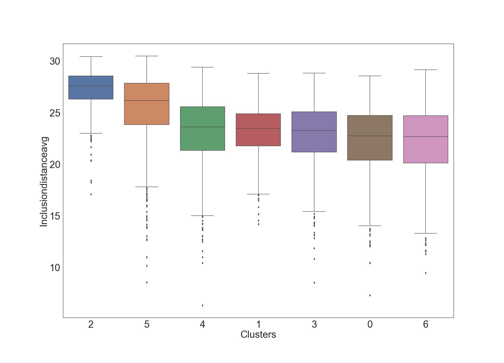
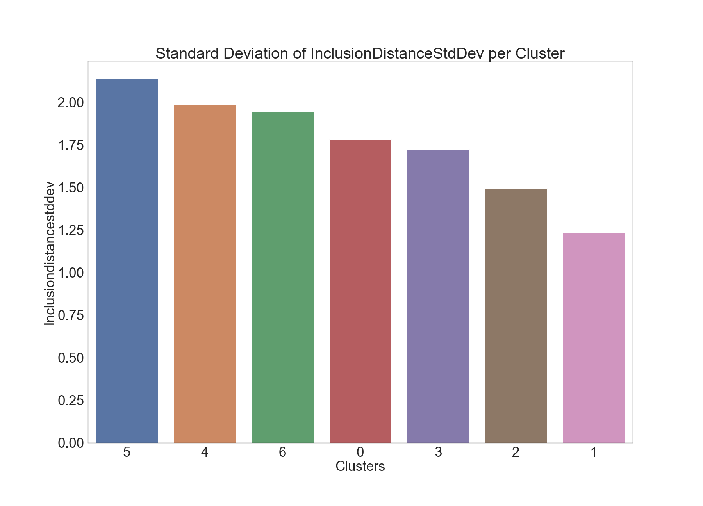
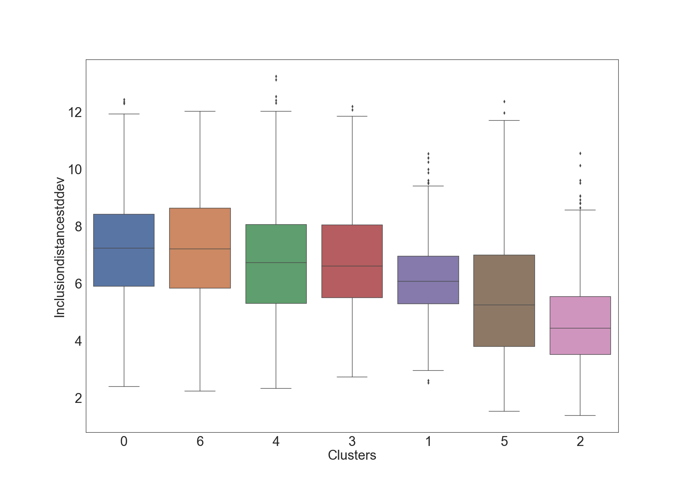
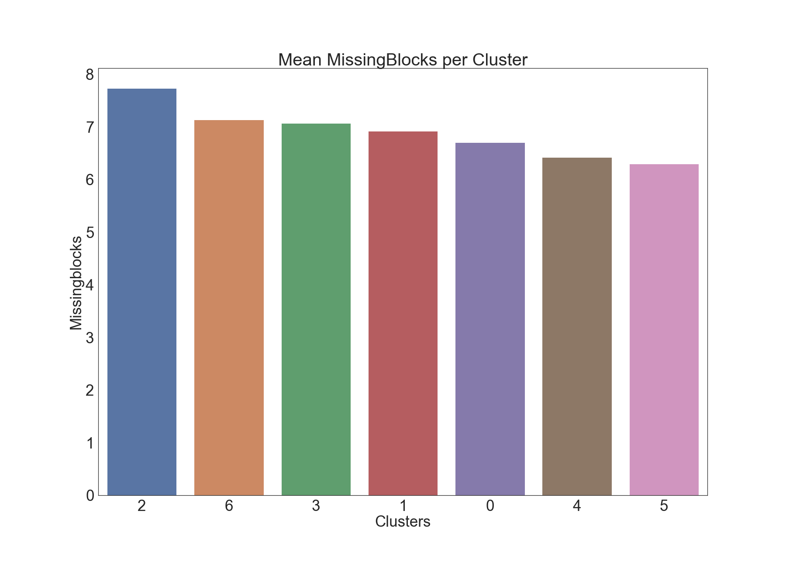

# Clustering Block Inclusion Delays in the Ethereum 2.0 Medalla Testnet

**Joseph Kholodenko, Gurdal Ertek**

Quote: timeline image.

**Summary:** In this article we provide insights regarding inclusion delay. 



## Data Sourcing, Extraction and Preparation
We gather the data based on aggregated slot level data:
- Inclusion Distance Avg
- Inclusion Distance Std Dev
- Attester Slashings
- Voluntary Exits
- Missing Blocks

### Techniques Used and Implementation

We use KMeans as our clustering method along with bar charts, box plots, and 3d visualization of attributes to illustrate heterogeneity among groups. Additionally, we use an approach to non-parametric statistical testing called the <a href="https://scikit-posthocs.readthedocs.io/en/latest/generated/scikit_posthocs.posthoc_dunn/>"Dunn test</a> to determine statisical differences between groups.

For voluntary exits and attester slashings, we omit the box plot due to a limited amount of non 0 data. Rather we visualize the non-zero data using 

For the accompanying code for this analysis, <a href="https://blockblockdata.github.io/medalla-data-challenge/a003/code/clustering.html">check out this link.</a>

## Clustering of Slots

We determined the number of k clusters by looking for the maximum <a href="https://scikit-learn.org/stable/modules/generated/sklearn.metrics.silhouette_score.html">Silhouette score</a>.

After selecting k=9, we looked at the counts of data per cluster. 7 of 9 clusters had 800-1000 points per cluster. 2 clusters had < 40 points per cluster, so we dropped those from the dataset.

## Insights - How do metrics vary across clusters?

### Inclusion Distance Average'
The bar charts provided below presents average inclusion distance for each cluster:

  </img>
  </img>

Next, the box plot shows more information about each cluster (e.g. IQR, outliers). 

  </img>

The box plot suggests differences across clusters with regards to average inclusion distance. 
We used formal hypothesis testing to determine the statistical significance of pairwise cluster means.
To this end, we applied the non-parametric Dunn test with Bonferroni correction, which yielded the following results.

In the table, a value of 1 denotes a statistically significant difference in means between that pair of attributes.

<ul>

  <li>{{ date.Name" }}-{{ date.Published }}</li>

</ul>

- Dunn test (1/0, display table in screen)

### Inclusion Distance Standard Deviation' 

  </img>
  </img>

  </img>

- Dunn test

### Attester Slashings

  </img>
  </img>

  </img>

- Dunn test

### Voluntary Exits

  </img>
  </img>

- Dunn test

### Missing Blocks

  </img>
  </img>

  </img>

- Dunn test

## Final Words

## Acknowledgements

We thank the authors of all the resources used in the article, as well as the Ethereum Community and Foundation. We especially thank [Jim McDonald](https://www.linkedin.com/in/jimgmcdonald/) for sharing the data used in the article and answering our many questions, [Ben Eddington](https://www.linkedin.com/in/benedgington/) for his rigorous documentation, [bluepintail](https://github.com/bluepintail) for openly sharing his/her analysis with the ethstaker community, and [Butta.eth](https://twitter.com/Butta_eth) for answering our questions on ethstaker. We also thank [Ivan Liljeqvist](https://www.linkedin.com/in/ivan-liljeqvist-697824198/) and the [Ivan on Tech](https://academy.ivanontech.com/a/27786/pVrJMEtL) team for creating a thriving community and motivating blockchain content. 

## Sign up to receive updates and analyses from us in the future:

<form action="https://formspree.io/f/xleojqvv" method="post">
  <label for="email">Your Email</label>
  <input name="Email" id="email" type="email">
  <button type="submit">Submit</button>
</form>

## Authors

<table>
  <tr>
    <td width=150px></td>
    <td><b>Joseph Kholodenko</b> is a freelance data science consultant. In the past he has worked as a Data Scientist at Google and taught at the Flatiron School as a Senior Lead Data Science Instructor. He is currently pursuing his MS in Computer Science with a specialization in machine learning at Georgia Institute of Technology.
    </td>
  </tr>
  <tr>
    <td width=150px></td>
    <td><b>Gürdal Ertek</b> is an Associate Professor at UAE University (UAEU), Al Ain, UAE. He received his Ph.D. from Georgia Institute of Technology, Atlanta, GA, in 2001. Dr. Ertek served in educational and research organizations in Turkey, USA, Singapore, Kuwait and UAE, as well as an on-site reviewer for 50+ industrial R&D projects. His research and teaching areas include applied data science, business analytics, supply chain management, project management, and R&D management. Dr. Ertek's research and other work can be accessed through <a href="http://ertekprojects.com" target="_blank">ErtekProjects.com</a> </td>
  </tr>
</table>

## APPENDIX: Software Stack & Tools

- Data Extraction
  - [PostgreSQL](https://www.postgresql.org/) for opening the database dumb provided by Jim McDonald

- Data Preparation
  - [Pandas](Python) https://pandas.pydata.org/docs/
  - [Numpy](Python)https://numpy.org/doc/
  - [Google Sheets](https://www.google.com/sheets/about/) for merging data from multiple SQL queries scalably on the cloud
  - [MS Excel](https://www.youtube.com/channel/UCJtUOos_MwJa_Ewii-R3cJA) for cleaning, adding new derived attributes, adding new attributes with jittering, and pivot analysis

- Clustering and Statistical Tests
  - [Sklearn] (Python) https://scikit-learn.org/0.21/documentation.html
  - [Scipy] (Python) https://www.scipy.org/docs.html

- Data Visualization
  - [Seaborn] (Python) https://seaborn.pydata.org/api.html
  - [Plotly] (Python) https://plotly.com/python-api-reference/
