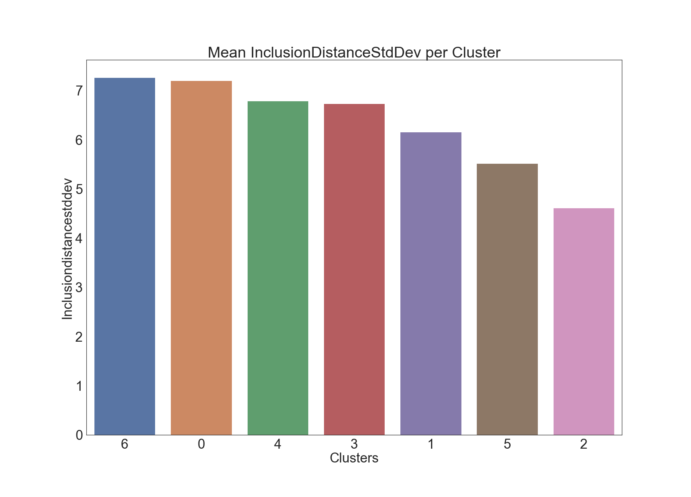
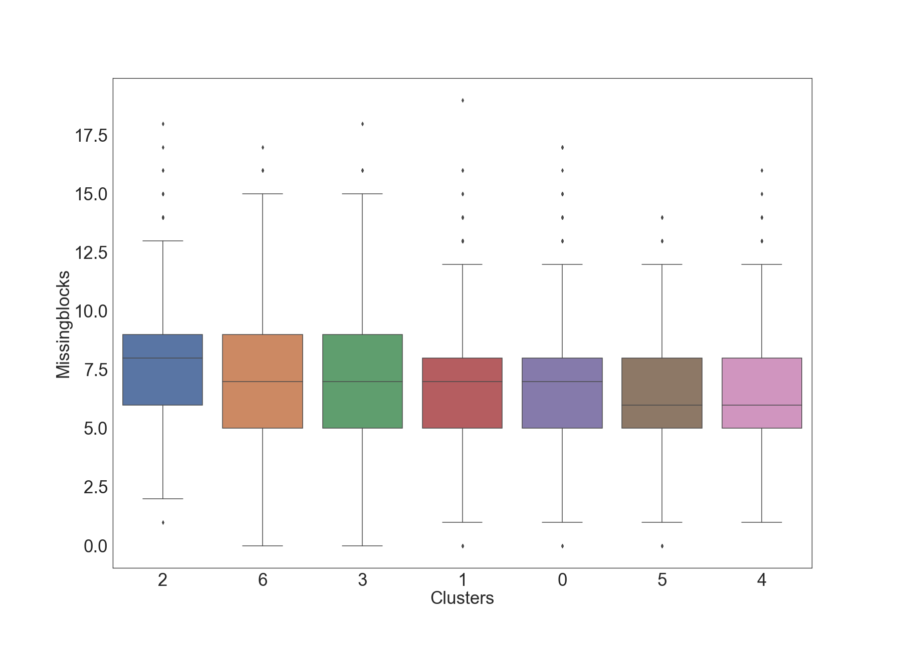

# Clustering and Profiling Time Epochs in Ethereum 2.0

**Joseph Kholodenko, Gurdal Ertek**

Kjpargeter - [Freepik.com](https://www.freepik.com/free-vector/collection-of-colorful-cubes_929235.htm)

In this article, we analyze the characteristics of different time epochs in the Ethereum 2.0 Medalla Testnet. Each epoch has different attributes such as the number of orphan slots (missing blocks), number of slashings and voluntary exits, and metrics regarding inclusion distance. Inclusion distance for a slot is defined as the number of slots passed until the block on that slot is included on the blockchain. Inclusion distance for an epoch is an aggregation over inclusion distances over slots, which can be represented with the average and standard deviation.

We apply cluster analysis, in particular K-means method, to create clusters of time epochs where the epochs in each cluster are similar in terms of their attributes, yet different than time epochs other clusters. Furthermore, we profile the clusters and compare the distribution of attribute across clusters of time epochs.

Statistical plots enable the formulation of hypotheses about the data, and formal hypothesis testing methods reveal the statistically significant differences for the means of attribute values accross clusters. 

## Data Sourcing, Extraction and Preparation

Our analysis is built on data from the Medalla testnet extracted using [`chaind` API](https://github.com/wealdtech/chaind) and shared in the form of an PostgreSQL dump, whose latest version can be [accessed from here](http://mdc.mcdee.net/chain-487600.dmp). The data was kindly shared by [Jim McDonald](https://github.com/mcdee?tab=overview&from=2014-12-01&to=2014-12-31) on [ethstaker Discord channel, under #medalla-data-challenge group](https://discord.com/channels/694822223575384095/752638638189445220). 

The successive steps of data extraction and data preparation are described in our earlier article. [link to article 2]

As a result of data extraction and preparation, we form a dataset suitable for clustering and profiling, based on aggregated epoch level data consisting of the following fields:
- Inclusion Distance Avg
- Inclusion Distance Std Dev
- Attester Slashings
- Voluntary Exits
- Missing Blocks

Our objective was to identify non-temporal characteristics of the time epochs, hence epoch was not included as an input attribute.

### Techniques Used and Implementation

Among the methods of data analytics, machine learning has a particularly special importance. Machine learning refers to computer algorithms learning from data, and can be  unsupervised, semi-supervised, and supervised. In unsupervised machine learning, the algorithm is provided only with the data itself, without any specified output (e.g. class labels). Frequently used unsupervised machine learning methods include clustering, association mining, and dimensionality reduction. In supervised machine learning, the algorithm is trained using a target attribute. Frequently used supervised machine learning methods are regression and classification.

In this article, we use the unsupervised machine learning method of KMeans clustering, along with bar charts, box plots, and 3D visualization of attributes to illustrate heterogeneity across clusters. Following visual analytics, we apply non-parametric statistical hypothesis testing through the <a href="https://scikit-posthocs.readthedocs.io/en/latest/generated/scikit_posthocs.posthoc_dunn/">Dunn test</a> to determine statisical differences between groups.

For voluntary exits and attester slashings, we omit the box plot due to a limited amount of non 0 data.

For the accompanying code for this analysis, <a href="https://blockblockdata.github.io/medalla-data-challenge/a003/code/clustering.html">check out this link.</a>

## Clustering of Slots

K Means clustering creates k clusters where each cluster consists of a subset of datapoints that are similar to each other with respect to attribute values. Yet the data points in a cluster are different compared to data points in other clusters. K Means produces cluster labels for data points as the main output of the algorithm.

A critical parameter in K Means is the number of clusters, k. While a multitude of metrics and methods exist on deciding the optimal k, we used Silhouette score as the metric to account for the mean intra-cluster distance and the mean nearest-cluster distance for each sample. In other words, Silhouette score is a reliable measure of both similarity within clusters and separation from other clusters. We determined the number of k clusters by looking for the maximum <a href="https://scikit-learn.org/stable/modules/generated/sklearn.metrics.silhouette_score.html">Silhouette score</a>. A score close to 1 indicates non-overlapping clusters, whereas a score near 0 indicates overlapping clusters.

The following figure shows silhouette score values for different numbers of clusters in K means.

Based on the figure above, k=9 is associated with the highest Silhouette score value with the highest separation across clusters.
After selecting k=9, we looked at the counts of data per cluster. 7 of the 9 clusters had 800-1000 points per cluster while 2 clusters had < 40 points per cluster. Therefore, we decided to drop those two small clusters from the dataset.

## Insights - How do metrics vary across clusters?

Having decided on the number of clusters (k=7), and having determined the datapoints in each cluster, the next step of our analysis was the profiling of clusters. To this end, our first visual analysis was a 3D visualization where our 3 axes are InclusionDistanceAvg, InclusionDistanceStdDev, and MissingBlocks, where color denotes the cluster ID. We selected these three attributes as a method to illustrate separation and overlap across cluster groups.

The 3D vizualization constructed using Plotly, is interactive and allows the user to develop a feel for different characteristics of each cluster. Mousing over individual data points reveals the data values and corresponding cluster assignments.



### Inclusion Distance Average
The bar charts provided below presents average inclusion distance for each cluster:

  
  

Next, the box plot shows more information about each cluster (e.g. IQR, outliers). 

  

The box plot suggests differences across clusters with regards to average inclusion distance. 

We used formal hypothesis testing to determine the statistical significance of pairwise cluster means.
To this end, we applied the non-parametric Dunn test with Bonferroni correction, which yielded the following results.

In the table, a value of 1 denotes a statistically significant difference in means between that pair of attributes. Here are the results:

|   | 0 | 1 | 2 | 3 | 4 | 5 | 6 | 
|---|---|---|---|---|---|---|---| 
| 0 | 0 | 1 | 1 | 0 | 1 | 1 | 0 | 
| 1 | 1 | 0 | 1 | 0 | 0 | 1 | 1 | 
| 2 | 1 | 1 | 0 | 1 | 1 | 1 | 1 | 
| 3 | 0 | 0 | 1 | 0 | 0 | 1 | 1 | 
| 4 | 1 | 0 | 1 | 0 | 0 | 1 | 1 | 
| 5 | 1 | 1 | 1 | 1 | 1 | 0 | 1 | 
| 6 | 0 | 1 | 1 | 1 | 1 | 1 | 0 | 

### Inclusion Distance Standard Deviation

  
  

  

Results of Dunn Test:

|   | 0 | 1 | 2 | 3 | 4 | 5 | 6 | 
|---|---|---|---|---|---|---|---| 
| 0 | 0 | 1 | 1 | 1 | 1 | 1 | 0 | 
| 1 | 1 | 0 | 1 | 1 | 1 | 1 | 1 | 
| 2 | 1 | 1 | 0 | 1 | 1 | 1 | 1 | 
| 3 | 1 | 1 | 1 | 0 | 0 | 1 | 1 | 
| 4 | 1 | 1 | 1 | 0 | 0 | 1 | 1 | 
| 5 | 1 | 1 | 1 | 1 | 1 | 0 | 1 | 
| 6 | 0 | 1 | 1 | 1 | 1 | 1 | 0 | 

### Attester Slashings

  
  

  

Results of Dunn Test:

|   | 0 | 1 | 2 | 3 | 4 | 5 | 6 | 
|---|---|---|---|---|---|---|---| 
| 0 | 0 | 0 | 0 | 0 | 0 | 0 | 0 | 
| 1 | 0 | 0 | 0 | 0 | 0 | 0 | 0 | 
| 2 | 0 | 0 | 0 | 0 | 0 | 0 | 1 | 
| 3 | 0 | 0 | 0 | 0 | 0 | 0 | 0 | 
| 4 | 0 | 0 | 0 | 0 | 0 | 0 | 0 | 
| 5 | 0 | 0 | 0 | 0 | 0 | 0 | 0 | 
| 6 | 0 | 0 | 1 | 0 | 0 | 0 | 0 | 

### Voluntary Exits

  
  

Results of Dunn Test:

|   | 0 | 1 | 2 | 3 | 4 | 5 | 6 | 
|---|---|---|---|---|---|---|---| 
| 0 | 0 | 0 | 1 | 0 | 0 | 0 | 0 | 
| 1 | 0 | 0 | 0 | 0 | 1 | 0 | 1 | 
| 2 | 1 | 0 | 0 | 1 | 1 | 1 | 1 | 
| 3 | 0 | 0 | 1 | 0 | 0 | 0 | 0 | 
| 4 | 0 | 1 | 1 | 0 | 0 | 0 | 0 | 
| 5 | 0 | 0 | 1 | 0 | 0 | 0 | 0 | 
| 6 | 0 | 1 | 1 | 0 | 0 | 0 | 0 | 

### Missing Blocks

  
  

  

Results of Dunn Test:

|   | 0 | 1 | 2 | 3 | 4 | 5 | 6 | 
|---|---|---|---|---|---|---|---| 
| 0 | 0 | 0 | 1 | 0 | 0 | 0 | 1 | 
| 1 | 0 | 0 | 1 | 0 | 1 | 1 | 0 | 
| 2 | 1 | 1 | 0 | 1 | 1 | 1 | 1 | 
| 3 | 0 | 0 | 1 | 0 | 1 | 1 | 0 | 
| 4 | 0 | 1 | 1 | 1 | 0 | 0 | 1 | 
| 5 | 0 | 1 | 1 | 1 | 0 | 0 | 1 | 
| 6 | 1 | 0 | 1 | 0 | 1 | 1 | 0 | 

## Acknowledgements

We thank the authors of all the resources used in the article, as well as the Ethereum Community and Foundation. We especially thank [Jim McDonald](https://www.linkedin.com/in/jimgmcdonald/) for sharing the data used in the article and answering our many questions, [Ben Eddington](https://www.linkedin.com/in/benedgington/) for his rigorous documentation, [bluepintail](https://github.com/bluepintail) for openly sharing his/her analysis with the ethstaker community, and [Butta.eth](https://twitter.com/Butta_eth) for answering our questions on ethstaker. We also thank [Ivan Liljeqvist](https://www.linkedin.com/in/ivan-liljeqvist-697824198/) and the [Ivan on Tech](https://academy.ivanontech.com/a/27786/pVrJMEtL) team for creating a thriving community and motivating blockchain content. 

## Sign up to receive updates and analyses from us in the future:

<form action="https://formspree.io/f/xleojqvv" method="post">
  <label for="email">Your Email</label>
  <input name="Email" id="email" type="email">
  <button type="submit">Submit</button>
</form>

## Authors

<table>
  <tr>
    <td width=150px></td>
    <td><b>Joseph Kholodenko</b> is a freelance data science consultant. In the past he has worked as a Data Scientist at Google and taught at the Flatiron School as a Senior Lead Data Science Instructor. He is currently pursuing his MS in Computer Science with a specialization in machine learning at Georgia Institute of Technology.
    </td>
  </tr>
  <tr>
    <td width=150px></td>
    <td><b>Gürdal Ertek</b> is an Associate Professor at UAE University (UAEU), Al Ain, UAE. He received his Ph.D. from Georgia Institute of Technology, Atlanta, GA, in 2001. Dr. Ertek served in educational and research organizations in Turkey, USA, Singapore, Kuwait and UAE, as well as an on-site reviewer for 50+ industrial R&D projects. His research and teaching areas include applied data science, business analytics, supply chain management, project management, and R&D management. Dr. Ertek's research and other work can be accessed through <a href="http://ertekprojects.com" target="_blank">ErtekProjects.com</a> </td>
  </tr>
</table>

## APPENDIX: Software Stack & Tools

- Data Extraction
  - [PostgreSQL](https://www.postgresql.org/) for opening the database dump provided by Jim McDonald

- Data Preparation
  - [Pandas](Python) https://pandas.pydata.org/docs/
  - [Numpy](Python) https://numpy.org/doc/
  - [Google Sheets](https://www.google.com/sheets/about/) for merging data from multiple SQL queries scalably on the cloud
  - [MS Excel](https://www.youtube.com/channel/UCJtUOos_MwJa_Ewii-R3cJA) for cleaning, adding new derived attributes, adding new attributes with jittering, and pivot analysis

- Clustering and Statistical Tests
  - [Sklearn](Python) https://scikit-learn.org/0.21/documentation.html
  - [Scipy](Python) https://www.scipy.org/docs.html

- Data Visualization
  - [Seaborn](Python) https://seaborn.pydata.org/api.html
  - [Plotly](Python) https://plotly.com/python-api-reference/
